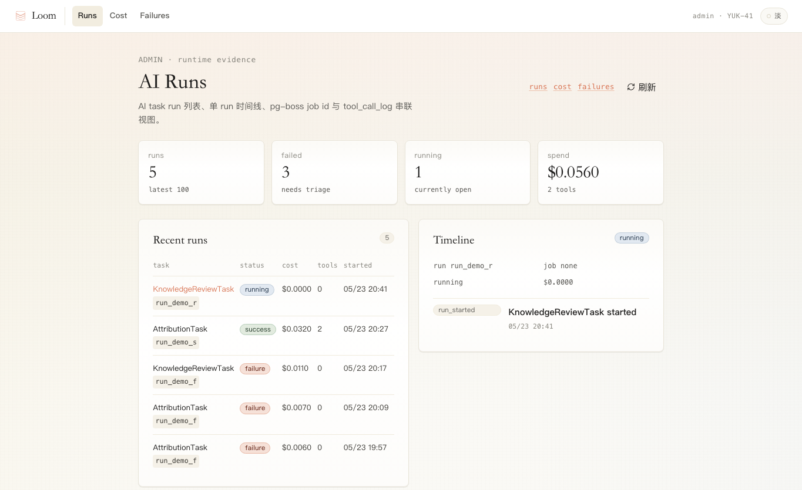

# AI Observability Admin Surface

YUK-41 adds a read-only admin surface for AI runtime observability. The UI reads existing runtime logs and does not write to `ai_task_runs`, `cost_ledger`, or `tool_call_log`.

## Routes

| Page | API | Purpose |
| --- | --- | --- |
| `/admin/runs` | `/api/admin/runs`, `/api/admin/runs/[id]` | Recent AI task runs, run status, cost, tool-call counts, pg-boss job ids, and single-run timeline. |
| `/admin/cost` | `/api/admin/cost?days=30` | Cost ledger trend by day and task kind. |
| `/admin/failures` | `/api/admin/failures` | Failed run clusters grouped by `finish_reason` and error-message prefix. |

## Auth Boundary

- Page routes live under `app/(admin)/admin/*` and are wrapped by `TokenGate` in `app/(admin)/layout.tsx`.
- API routes live under `app/api/admin/*`.
- `middleware.ts` keeps the existing `matcher: '/api/:path*'`, so `/api/admin/*` is protected by `INTERNAL_TOKEN` without adding a new matcher exemption.
- `/api/health` remains the only explicit API auth exemption.

## Why Not `/api/_/admin/*`

Do not place production UI dependencies under `app/api/_/*`.

Next.js treats underscore-prefixed folders as private implementation details, so they are excluded from routing. This repo already has the same precedent in `app/api/cost/today/route.ts`: Phase 1d moved the UI-facing cost endpoint out of `/api/_/logs/cost` to `/api/cost/today`.

The existing `app/api/_/*` endpoints remain appropriate for admin/dev utilities such as backfill, export, import, logs, and seed. YUK-41 needs routable production UI APIs, so it uses `/api/admin/*`.

## Browser Verification

Screenshot:

Verification notes from local browser run:

- Started `pnpm dev:local` against an isolated verification database `loom_yuk41_admin_verify`.
- Applied project migrations from zero to the isolated database.
- Used a temporary local `INTERNAL_TOKEN=dev-token` and seeded sample observability rows only in the isolated database.
- Verified missing token shows `TokenGate` instead of admin content.
- Verified `/admin/runs`, `/admin/cost`, and `/admin/failures` render data through `/api/admin/*`.
- Verified mobile width `390px`: no page-level horizontal overflow on runs, cost, or failures.
