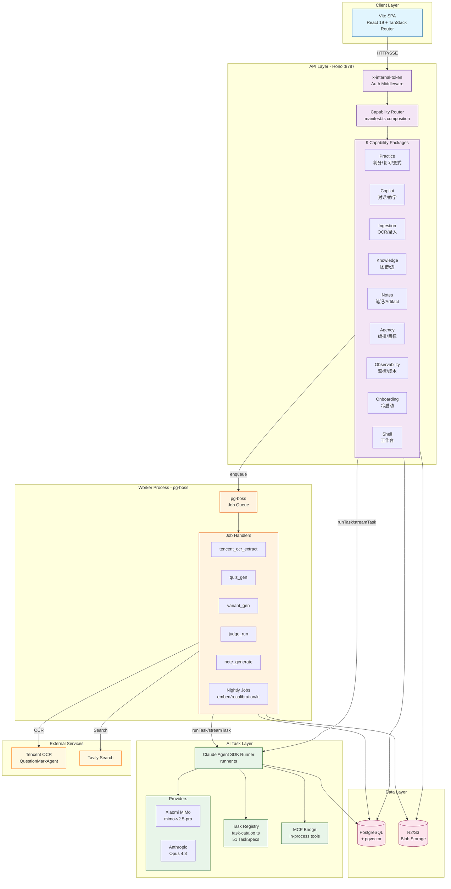

# AI Pipeline Architecture - The Learning Project

## Overview

This document visualizes the AI pipeline architecture of The Learning Project, a self-hosted learning system with sophisticated AI task orchestration.

## Architecture Diagram



## Key Components

### 1. Task Registry (51 TaskSpecs)

The central `task-catalog.ts` composes TaskSpecs from 6 capability owner maps:

| Capability | Task Count | Examples |
|------------|------------|----------|
| Practice | 19 | AttributionTask, VariantGenTask, JudgeTasks |
| Notes | 3 | NoteGenerateTask, NoteVerifyTask |
| Ingestion | 8 | VisionExtractTask, StructureTask, TaggingTask |
| Knowledge | 3 | KnowledgeEdgeProposeTask, KnowledgeReviewTask |
| Agency | 13 | DreamingTask, CoachTask, MindModelInductionTask |
| Copilot | 5 | CopilotTask, CopilotDispatchTask, EvidenceReviewTasks |

### 2. Execution Flow

```
User Action → Capability Route → Task Runner → Provider
                     ↓
              pg-boss Job → Task Runner → Provider
```

### 3. Tool Calling Architecture

- **DomainTool Registry**: Static assembly from capability manifests
- **MCP Bridge**: In-process MCP server for Claude Agent SDK
- **Tool Effects**: `read` | `propose` | `write` (write requires user accept)

### 4. Cost & Observability

- Every AI call writes to `ai_task_runs` + `ai_cost_ledger`
- Tool calls logged to `tool_call_log`
- Provider admission control with `provider_attempt` lifecycle

## Evidence

- `src/ai/task-catalog.ts` - Task composition root
- `src/server/ai/runner.ts` - Claude Agent SDK adapter
- `src/capabilities/*/manifest.ts` - Capability declarations
- `docs/architecture.md` - §5 AI Task Layer
