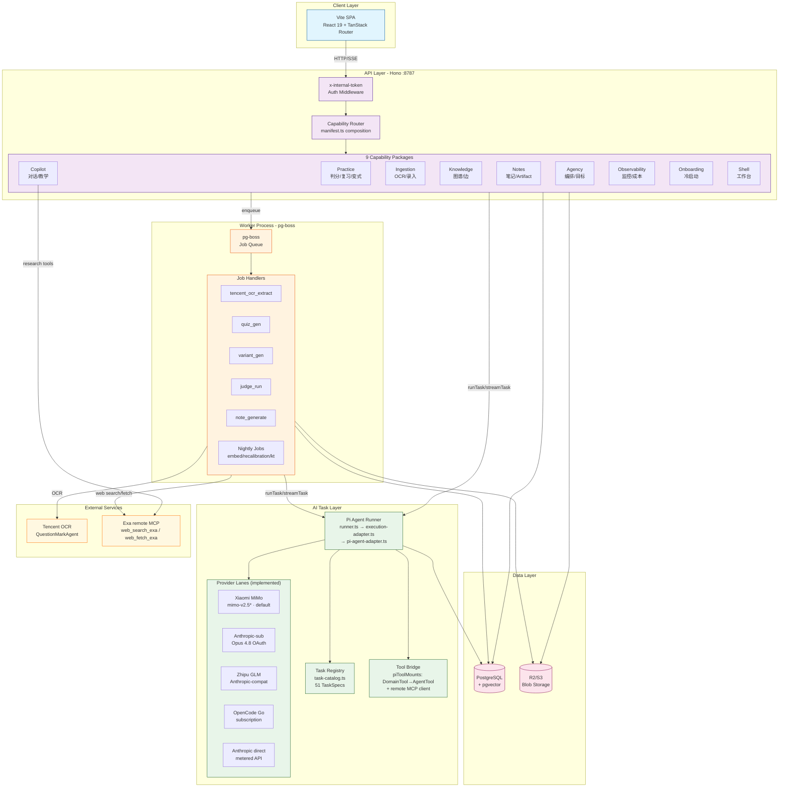

# AI Pipeline Architecture - The Learning Project

## Overview

This document visualizes the AI pipeline architecture of The Learning Project, a self-hosted learning system with sophisticated AI task orchestration.

> **状态口径（YUK-1030）**：本文描述 **main 源码状态**——YUK-921 P0–P4 已交付，
> `PiAgentAdapter`（`@earendil-works/pi-agent-core` in-process agentLoop）是唯一执行
> 引擎，Claude Agent SDK 已于 YUK-1025 退役。**生产部署状态不同**：当前生产镜像仍为
> `c89079b68`（PLAN.md 头部，pi 迁移批次尚未部署），线上跑的仍是 SDK 子进程时代码。

## Architecture Diagram



## Key Components

### 1. Task Registry (51 TaskSpecs)

The central `task-catalog.ts` composes TaskSpecs from 6 capability owner maps
(`composeTaskCatalog` enforces `expectedCount = 51` at module load):

| Capability | Task Count | Examples |
|------------|------------|----------|
| Practice | 22 | AttributionTask, VariantGenTask, JudgeTasks, QuizGenTask, SourcingTask, SupplyPlanTask |
| Ingestion | 8 | VisionExtractTask, StructureTask, TaggingTask |
| Knowledge | 3 | KnowledgeEdgeProposeTask, FrontierPrerequisiteTask, KnowledgeReviewTask |
| Notes | 3 | NoteGenerateTask, NoteVerifyTask, NoteRefineTask |
| Agency | 13 | DreamingTask, CoachTask, MindModelInductionTask, ResearchMeetingDirectorTask |
| Copilot | 2 | CopilotTask, TeachingTurnTask |

### 2. Execution Flow

```
User Action → Capability Route → Task Runner → Provider
                     ↓
              pg-boss Job → Task Runner → Provider
```

All four runner entry points (`runTask` / `runAgentTask` / `streamTask` /
`streamTaskCollecting`) resolve through the `ExecutionAdapter` seam
(`execution-adapter.ts`). Post-YUK-1025 this is a fail-closed guard, not a
router: every attempt resolves to `PiAgentAdapter`, which runs
`@earendil-works/pi-agent-core` `agentLoop` in-process (no CLI subprocess) and
normalizes pi events into the SDKMessage-shaped frames the durable lifecycle
consumes.

### 3. Tool Calling Architecture

- **DomainTool Registry**: Static assembly from capability manifests — 45 tools
  declared via `copilotTools` across 6 packages (practice 14 / ingestion 11 /
  agency 8 / knowledge 6 / copilot 4 / notes 2).
- **piToolMounts** (`tools/pi-tools.ts`): `piDomainMount` compiles registry
  DomainTools into pi `AgentTool`s; `piRemoteMcpMount` bridges remote MCP
  servers (Exa) through a real `@modelcontextprotocol/sdk` client. Wire names
  stay `mcp__<server>__<tool>`.
- **Shared pipeline**: every tool executes through `executeDomainToolCall`
  (`tools/mcp-bridge.ts`) — engine-neutral `tool_call_log` / `tool_use` mirror /
  `beforeExecute` / cancellation.
- **Tool Effects**: `read` | `propose` | `write` (write requires user accept)
- **piHooks** (`pi-hooks.ts`): ordered `beforeToolCall` gates (spawn-contract) +
  `afterToolCall` observers — the only tool-call interception surface post-P4.

### 4. Provider Lanes

Resolution order (`resolveTaskProvider` in `providers.ts`):
`ctx.override` / `ctx.modelBinding` (per-run) → `AI_PROVIDER_OVERRIDE` /
`AI_PROVIDER_MODEL` env switch → task registry `defaultProvider`/`defaultModel`.

| Lane | Status | Notes |
|------|--------|-------|
| xiaomi | **default** | `mimo-v2.5-pro` / `mimo-v2.5` via Anthropic-compat endpoint (`api.xiaomimimo.com/anthropic`) |
| anthropic-sub | implemented | Opus 4.8 via Claude Max OAuth (`CLAUDE_CODE_OAUTH_TOKEN`, `sk-ant-oat*` → Bearer) |
| anthropic | implemented | Direct metered API (`ANTHROPIC_API_KEY`) |
| zhipu | implemented | GLM coding plan Anthropic-compat endpoint |
| opencode-go | implemented | Subscription catalog; requires `x-opencode-session` header per run |
| openrouter / gateway / openai | reserved, not wired | registry entries exist; `resolveTaskProvider` throws |

### 5. External Services

- **Tencent OCR** — `tencent_ocr_extract` job (QuestionMarkAgent).
- **Exa** — hosted remote MCP (`https://mcp.exa.ai/mcp`, `EXA_API_KEY` via
  `x-api-key` header), exposes `web_search_exa` + `web_fetch_exa`; mounted by
  `piRemoteMcpMount` in copilot research, `web_fetch_candidates` and the
  `quiz_gen` sourcing path. Replaced Tavily on 2026-09-13 (PR #1384); legacy
  `'tavily'` values remain parse-compatible in stored schemas only.

### 6. Cost & Observability

- Every AI call writes to `ai_task_runs` + `cost_ledger`
- Tool calls logged to `tool_call_log`
- Provider admission control with `provider_attempt` lifecycle
- pi `usage.cost` is a catalog-rate estimate → `cost_basis: 'estimated'`
  (contractual USD reporting retired with the SDK)

## Evidence

- `src/ai/task-catalog.ts` - Task composition root (expectedCount 51)
- `src/server/ai/runner.ts` - Runner entry points (`runTask`/`runAgentTask`/`streamTask`/`streamTaskCollecting`)
- `src/server/ai/execution-adapter.ts` - ExecutionAdapter seam; `'pi'` is the only legal engine id
- `src/server/ai/pi-agent-adapter.ts` - PiAgentAdapter (in-process agentLoop, frame normalization)
- `src/server/ai/providers.ts` - Provider registry + resolution order
- `src/server/ai/tools/pi-tools.ts` - piToolMounts (DomainTool→AgentTool + remote MCP bridge)
- `src/server/ai/mcp/exa.ts` - Exa remote MCP wiring
- `src/capabilities/*/manifest.ts` - Capability declarations (routes/jobs/copilotTools)
- `docs/architecture.md` - §5 AI Task Layer
- `src/server/ai/AGENTS.md` - authoritative pi-engine operator detail
