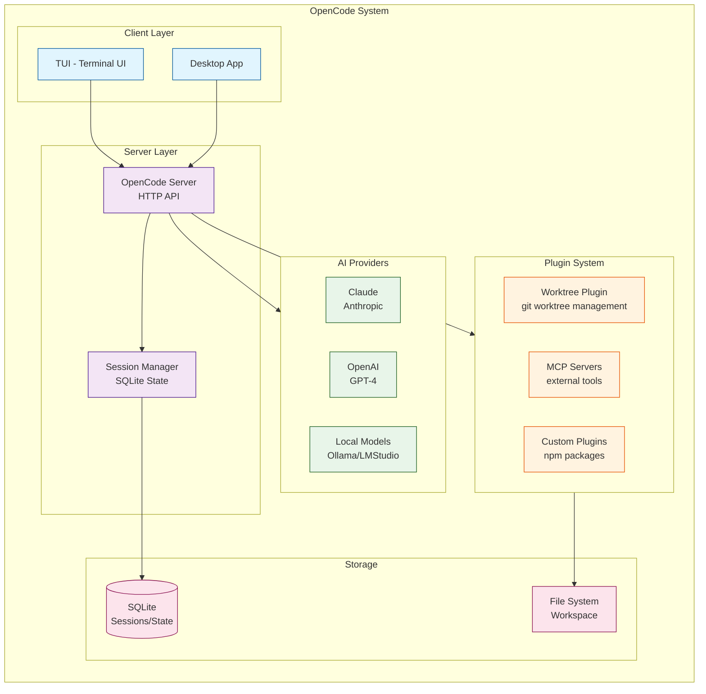

# OpenCode Architecture Comparison

## Overview

This document compares The Learning Project's AI pipeline with OpenCode's architecture.

## OpenCode Architecture



## Side-by-Side Comparison

| Aspect | The Learning Project | OpenCode |
|--------|---------------------|----------|
| **Primary Purpose** | Learning/Education Platform | AI Coding Assistant |
| **Architecture** | Multi-process (API + Worker) | Single Server + Plugins |
| **AI Orchestration** | Task-based (51 TaskSpecs) | Session-based (conversations) |
| **Tool System** | DomainTool Registry + MCP Bridge | MCP Servers + Plugin Tools |
| **State Management** | PostgreSQL + Event Sourcing | SQLite + File System |
| **Job Queue** | pg-boss (PostgreSQL) | In-process / External |
| **Provider Support** | Xiaomi MiMo, Anthropic | Claude, OpenAI, Local Models |
| **Multi-modal** | Vision OCR, Image Analysis | Text-focused |
| **Cost Tracking** | ai_cost_ledger + provider_attempt | Basic usage tracking |
| **Extensibility** | Capability Packages | Plugin System |

## Key Differences

### 1. Task vs Session Model

**The Learning Project**:
- 51 typed TaskSpecs with explicit input/output schemas
- Budget-controlled execution (maxIterations, maxCost, timeout)
- Durable job queue with pg-boss
- Event sourcing for all AI actions

**OpenCode**:
- Session-based conversation model
- Tool calls within conversation context
- Plugin-provided tools
- Simpler state management

### 2. Tool Architecture

**The Learning Project**:
```typescript
interface DomainTool<Input, Output> {
  name: string;
  effect: 'read' | 'propose' | 'write';
  inputSchema: z.ZodType<Input>;
  outputSchema: z.ZodType<Output>;
  execute(ctx: ToolContext, input: Input): Promise<Output>;
}
```

**OpenCode**:
```typescript
// Plugin tool definition
tool({
  description: string,
  args: Schema,
  execute: (args, ctx) => Result
})
```

### 3. Data Flow

**The Learning Project**:
```
User → API Route → Capability → Task Runner → Provider
                ↓
           pg-boss Job → Task Runner → Provider
                ↓
           Event Stream → PostgreSQL
```

**OpenCode**:
```
User → TUI/Desktop → Server → Provider
              ↓
         Plugin Tools
              ↓
         SQLite/FS
```

## Integration Points

The Learning Project uses OpenCode's worktree plugin for development workflow:

```json
// .opencode/worktree.jsonc
{
  "sync": {
    "copyFiles": [".env", ".env.local"],
    "symlinkDirs": ["node_modules"]
  },
  "hooks": {
    "postCreate": ["pnpm install"],
    "preDelete": []
  }
}
```

## Evidence

- `.opencode/plugins/worktree.ts` - Worktree plugin implementation
- `src/ai/task-catalog.ts` - Task composition
- `src/server/ai/tools/registry.ts` - DomainTool registry
