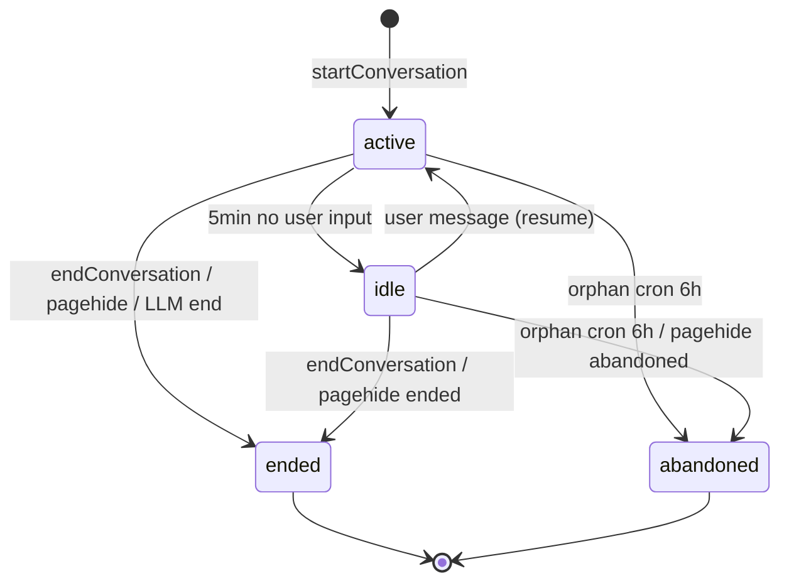

# Teaching Idle State Machine — Design

**Status**: design only — 等用户 approve（per `docs/superpowers/plans/2026-05-24-product-track-1-closeout.md` §M1.1 exit criteria）。实现交给 [YUK-14](https://linear.app/yukoval-studios/issue/YUK-14)。
**Date**: 2026-05-24
**Linear**: [YUK-13](https://linear.app/yukoval-studios/issue/YUK-13)
**Author**: AI subagent (Wave 1 Lane 1)
**Related**:
- [`docs/adr/0013-review-session-lifecycle.md`](../adr/0013-review-session-lifecycle.md) — `/review` session lifecycle，本 design 直接 mirror 此 pattern
- [`docs/adr/0008-learning-session-multi-type-envelope.md`](../adr/0008-learning-session-multi-type-envelope.md) — `learning_session(type='conversation')` envelope + 三态 enum `active | idle | ended` 占位
- [`src/server/session/conversation.ts`](../../src/server/session/conversation.ts) — Phase 2C MVP，当前只走 `active → ended`
- [`src/ui/components/TeachingDrawer.tsx`](../../src/ui/components/TeachingDrawer.tsx) — chat drawer，目前 mount=start / unmount-不-end / 无 idle UX
- [`docs/superpowers/brainstorms/2026-05-17-phase2c-active-teaching.md`](../superpowers/brainstorms/2026-05-17-phase2c-active-teaching.md) §"最可能漂移的点" #4 — idle 留空的原始决策点

---

## Background

Phase 2C 教学循环（[`src/server/session/conversation.ts`](../../src/server/session/conversation.ts) + [`app/api/teaching-sessions/**`](../../app/api/teaching-sessions/) + [`src/ui/components/TeachingDrawer.tsx`](../../src/ui/components/TeachingDrawer.tsx)）已 ship，但 session lifecycle 是「最小可工作」版本：

- MVP 只实装 `active → ended` 单条路径（`src/server/session/conversation.ts:14` 显式注释「idle 状态本期不实装」）
- `ConversationStatus` enum 已经声明 `'active' | 'idle' | 'ended'`（`src/core/schema/learning_session.ts:41`）—— **enum 占位但行为空**
- `TeachingDrawer` mount 时 POST `/api/teaching-sessions` 开 session，**unmount 不 close、无 pagehide、无 idle timer、无 orphan cron**。结果：
  - 用户关 drawer / 关 tab / 浏览器崩溃 → session 永远 `active`，污染 `/today` ribbon 和未来的 session-end summary
  - LLM `turn_kind='end'` 时 UI 只显示 banner，session 状态仍 `active`，最终也走不到 `ended`
  - UI 没有「用户走开」语义：等 LLM reply 时的 spinner 跟「用户读完上一段还没敲键盘」无法区分 —— phase spec 描述的 "UI 一直 spinner" 来源

这跟 `/review` 在 [ADR-0013](../adr/0013-review-session-lifecycle.md) 落地前的状态高度同构：state envelope 已建，但「关 / abandon / 兜底」没接电。本 design 的任务是给 conversation 补上同样的 lifecycle，并额外补上 `idle` 这层 review 没有的语义（review 是「翻卡」节奏，conversation 是「对话」节奏，conversation 需要显式 idle 让 UI 切到「等用户回」状态）。

---

## Goals

1. 给 `learning_session(type='conversation')` 一条完整的、可观测的 lifecycle：start → 正常 end / idle 后 end / 显式 abandon / orphan 兜底。
2. UI 能区分四种状态语义：
   - **active + 等 LLM**：spinner（已有）
   - **active + 等用户**：composer 可输入（已有，但当前跟 idle 没区分）
   - **idle**：用户走开 ≥N 分钟，UI 标黄 + 显示 resume CTA；用户敲字 → 自动恢复 active
   - **ended / abandoned**：UI 锁住，结束语 + 重开 CTA
3. 不污染数据：tab 关 / 浏览器崩 / 网断 → 6h 内 orphan cron 标 abandoned。
4. **mirror ADR-0013 pattern**：能复用 `/review` 已经验证过的 sendBeacon + cron + transition guard 三件套，最大化跨 session-type 一致性。
5. 不引入新表 / 不动 `KnownEvent`。

## Non-goals

- ❌ **Pause / resume API**：「显式暂停」与本期 idle 不同；idle 是 server 自动推断，pause 是用户主动按钮。pause 留给 [YUK-57](https://linear.app/yukoval-studios/issue/YUK-57) Review P2.2（同模式可日后延伸到 conversation）。
- ❌ **Idle 时 LLM 自动 nudge**（"你还在吗？"agent message）：属于 dreaming / coach 范畴，本期纯客观 lifecycle，不让 LLM 主动 turn。
- ❌ **跨 tab 单例锁**（同 ADR-0013 §"接受的代价"）：每 tab 独立 session 是合理的；不引入跨 tab coordination。
- ❌ **Streaming 中途断开的部分消息持久化**：本期 turn 是非 streaming 一次性返回，断开就是断开，由 `turnM.isError` 兜底；conversation lifecycle 本身不关心 turn-level 失败。
- ❌ **Abandoned session 自动 resume**：abandoned 是终态。Resume 入口是新开 session（drawer 重开 = 新 `learning_session` row）—— 跟 `/review` abandoned 处理一致。abandoned session 在 `/learning-sessions/[id]` 仍可查看历史。
- ❌ **idle timeout 阈值的 A/B 调参 / 自适应**：单值 N 写死，先 N=5 分钟（理由见 §Open questions）。

---

## State enum

复用 `src/core/schema/learning_session.ts` 的 `ConversationStatus`，**追加 `'abandoned'`**：

```ts
// src/core/schema/learning_session.ts (proposed)
export const ConversationStatus = z.enum([
  'active',     // 已有 — 用户/agent 正在交替 turn
  'idle',       // 已有 — schema 占位，本 design 第一次实装
  'ended',      // 已有 — 正常或 LLM 建议结束后的终态
  'abandoned',  // 新增 — orphan cron 或 sendBeacon abandoned 标记的终态
]);
```

| Status | 语义 | 类别 |
|---|---|---|
| `active` | drawer 开 + 最近 N 分钟内有 user 或 agent message | live |
| `idle` | drawer 仍开但最近 N 分钟无 user 输入（agent reply 不刷新 idle clock，见 §Transition rules） | live |
| `ended` | 用户显式按"结束" / drawer unmount / pagehide / LLM `turn_kind='end'` 后用户接受 | terminal |
| `abandoned` | orphan cron 标记（6h 仍 `active` 或 `idle`） / 显式 abandoned beacon | terminal |

**为什么不引入 `'awaiting_user'`？**
原 Linear issue 描述里列了 `awaiting_user`。但仔细推敲：`active` 状态本身就涵盖「等 user 输入」+「等 agent reply」两种瞬时；UI 区分这两种应该读「最近 message 的 actor_kind」（已有数据，零新字段），而不是 server status 多枚举。多一个 `awaiting_user` 状态：
- 需要 server 在每次 user message in / agent message out 时各写一次 transition → 写放大、event 噪音
- 客户端轮询 status 的频率必须高到能反映瞬时切换 → 实时性要求过强
- 不解决 spec 的核心痛点（spinner 不切走 = 用户走开了系统不知道）

**保留 `idle` 的理由 vs 也不要 `idle`**：
不引入 `idle` 的反方案是「只有 `active` 和 `ended`，让 UI 自己根据 last activity 在客户端判断 idle 显示」。但 server-side `idle` 状态有 3 个好处：
1. **多 tab 一致**：用户在 tab A 走开 6 分钟，tab B 同 session（极少见但可能）打开能马上看到 idle 标记。
2. **orphan cron 决策更精细**：6h 内有过 idle 转移 → 优先 abandoned；从未 idle 直接 abandoned 也可标记不同 reason。
3. **未来 dreaming 触发点**：idle 状态作为 dreaming agent 「这位走开了，要不要提议总结」的 hook（不在本期实装，但 enum 已就位）。

### State diagram

```
                     +----------+
                     | (none)   |
                     +----+-----+
                          | startConversation
                          v
                  +---------------+
       resume     |               |  no input ≥N min
   ┌-------------▶|    active     |--------------┐
   │              |               |              │
   │              +-------+-------+              │
   │                      |                      v
   │                  endC|onversation     +----------+
   │                      |   (explicit /  |  idle    |
   │                      |    pagehide /  +-----+----+
   │                      |    drawer      | resume (user msg)
   │                      |    unmount)    | endConversation
   │                      |                | abandonConversation
   │                      v                | (orphan cron 6h)
   │              +---------------+        |
   │              |   ended       |◀-------┘
   │              +---------------+
   │
   │              +---------------+
   └---<---<--<---|   abandoned   |◀ orphan cron 6h
                  +---------------+
                  (also: explicit abandoned beacon
                  in pagehide if drawer was already
                  shown as idle, see §Transition rules)
```

Mermaid 等价表达（如需在 Linear / GitHub 看 rendered diagram）：



---

## Transition rules

| # | Trigger | From | To | Owner | Side effects |
|---|---|---|---|---|---|
| T1 | `startConversation` (POST `/api/teaching-sessions`) | `(none)` | `active` | route | INSERT row; `job_events` `conversation.started`; agent opening message via `experimental:teach_message` event |
| T2 | User message arrives (`POST /api/teaching-sessions/[id]/turn`) | `active` | `active` | turn route | bump `updated_at`; **no status transition write** — `assertActive` only |
| T2b | User message arrives | `idle` | `active` | turn route | UPDATE status='active', updated_at=now(); `job_events` `conversation.resumed` |
| T3 | Agent reply persisted | `active` | `active` | turn route | bump `updated_at`; no status transition (agent reply does **not** reset idle clock — see "Idle clock" below) |
| T4 | Idle timer fires server-side: `now - updated_at ≥ IDLE_MS` AND status=`active` | `active` | `idle` | scheduled job (`promote_conversation_idle` boss handler running every 1 min) | UPDATE; `job_events` `conversation.idle` |
| T5 | `endConversation` (POST `/api/teaching-sessions/[id]/end` with `{status: 'ended'}` or default) | `active` \| `idle` | `ended` | end route | UPDATE status, ended_at=now(); `job_events` `conversation.ended` |
| T6 | `abandonConversation` (POST `/api/teaching-sessions/[id]/end` with `{status: 'abandoned'}`, typically via sendBeacon when drawer was visibly idle) | `active` \| `idle` | `abandoned` | end route | UPDATE; `job_events` `conversation.abandoned` |
| T7 | Orphan cron: `type='conversation' AND status IN ('active','idle') AND started_at < now() - 6h` | `active` \| `idle` | `abandoned` | `prune_orphan_conversation_sessions` boss handler (daily, schedule `25 4 * * *` BJT, 10 min after `prune_orphan_review_sessions`) | UPDATE; `job_events` `conversation.abandoned` with payload `{ reason: 'orphan_cron', cron_cutoff_ms: 6h }` |
| T8 | LLM returns `turn_kind='end'` | `active` | `active` (no transition) | turn route | UI surfaces "教练建议结束" hint (current behaviour); transition is **user-driven** via T5 |

### Idle clock semantics

「Idle」语义上是「用户离开」。判定基础是 **最后一次 user message 之后多久** —— agent reply 不重置 idle clock，否则一个长 chain of agent autopilot turn 会永远不 idle（虽然本期没自动 turn，预留未来 dreaming）。

具体实现：
- 用 `learning_session.updated_at` 作为 idle clock 基线（**改语义**：T2/T3 都 bump `updated_at`），但 idle promote 时**额外**用 `event` 表查最新 user message timestamp：
  ```sql
  WITH last_user AS (
    SELECT MAX(e.created_at) AS at
    FROM event e
    WHERE e.session_id = ls.id
      AND e.actor_kind = 'user'
      AND (e.payload->>'role') = 'user'
  )
  UPDATE learning_session ls SET status = 'idle', updated_at = now()
  WHERE ls.type = 'conversation' AND ls.status = 'active'
    AND COALESCE((SELECT at FROM last_user), ls.started_at) < now() - INTERVAL '5 minutes';
  ```
- 这样 `updated_at` 仍可作为 "最近 server-side touch" 索引项；idle 判定走真实 user activity。
- **替代方案（rejected）**：加新列 `last_user_activity_at`。否决理由：单字段冗余，event 表已经是 source of truth；conversation 单 session ≤ 50 turn（per brainstorm doc §"风险登记"），LIMIT 1 索引扫开销可忽略。

### Idle promotion 频率

- 每分钟一次 boss scheduled job（`promote_conversation_idle`）—— 不在 turn route 内做，避免每次 turn 多一次 scan。
- N=5min cutoff + 1min 扫频 → idle 状态延迟 0~1 分钟，UI 体验是「走开 5~6 分钟开始看到 idle banner」，可接受。
- **替代方案 A（rejected）**：客户端 setInterval 5min 后 POST `/api/teaching-sessions/[id]/idle`。否决理由：客户端可能 tab inactive、setInterval throttle、JS 异常都 miss；server-side 才可靠。
- **替代方案 B（rejected）**：在 turn route 内 lazy 检查（"上一次 turn 距今 ≥5min → 先标 idle 再处理 turn"）。否决理由：只能 catch「用户走开后又回来」case，catch 不到「用户走开后再也不来」case，达不到 spec 「区分 spinner」的目的。

### Pagehide / sendBeacon

跟 `/review` 同 pattern：
- `TeachingDrawer` mount 时 `useEffect` 加 `window.addEventListener('pagehide', ...)` → `navigator.sendBeacon('/api/teaching-sessions/[id]/end', Blob([JSON.stringify({status: 'ended'})], {type:'application/json'}))`
- Drawer unmount cleanup 用 fetch end with `{status:'ended'}`（非 pagehide 路径）
- **细化**：如果 drawer 当前**已经显示 idle banner**，pagehide 时改发 `{status: 'abandoned'}` —— 信号「用户走开了又关了 tab，不是主动结束」。否则按 ended 处理。这给 `/today` ribbon 更准确的「完成 / 走丢」分类。

`/api/teaching-sessions/[id]/end` route 跟 `/api/review/sessions/[id]/end` 同 parse 逻辑：
- `Content-Type: application/json` → parse body for `{status: 'ended' | 'abandoned'}`，默认 `'ended'`
- 其它 Content-Type（sendBeacon `text/plain` fallback）→ try JSON.parse text，否则默认 `'ended'`

### Orphan cron

- Handler: `src/server/boss/handlers/prune_orphan_conversation_sessions.ts`（仿 `prune_orphan_review_sessions.ts`）
- Schedule: `25 4 * * *` BJT，10 min after `prune_orphan_review_sessions`（避免 lock contention）
- 6h cutoff（同 ADR-0013）。理由：单用户场景，一次教学 session ≤ 1h，6h 是「绝对不可能还在进行」的安全边界。

### Reject 表 — 哪些 transition 不允许？

| Attempted | 拒绝 reason |
|---|---|
| `ended` → 任何 | terminal，throw 409 conflict |
| `abandoned` → 任何 | terminal，throw 409 conflict |
| `idle` → `idle` | no-op，promote handler 通过 `WHERE status='active'` 过滤 |
| `active` → `abandoned` 直接 (绕过 idle) | **允许** —— pagehide 路径可直接 active→abandoned；不强制经过 idle |

`src/server/session/guards.ts` 的 `assertFromState` 已经能 handle 这些（review 模块同套）。

---

## Persistence design

### Schema

复用 `learning_session` 表，**只改 enum**：

```ts
// src/core/schema/learning_session.ts diff (proposed, 实现在 YUK-14)
- export const ConversationStatus = z.enum(['active', 'idle', 'ended']);
+ export const ConversationStatus = z.enum(['active', 'idle', 'ended', 'abandoned']);
```

无 schema migration（`learning_session.status` 是 `text`，application-level enum）。但是：

- **`pnpm audit:schema` 影响**：`status` 字段已经有 write path（`Conversation.startConversation` / `endConversation`），加入 idle / abandoned 后必须确保 `YUK-14` 引入 `idleConversation()` + `abandonConversation()` transition fn，把 enum 的两个新值都接电。这是 audit:schema 检查的 invariant（参见 [`docs/design/2026-05-15-data-assumptions.md`](2026-05-15-data-assumptions.md)）。
- 不需要新 `started_at` / `ended_at` 字段（`learning_session` 已有 `started_at` + `ended_at` + `updated_at` + `version`，复用即可）

### Event payload — state transition

State transition **不写 `event` 表**，写 `job_events` 表（仿 review / current conversation pattern）。理由：
- transition 是 server-side lifecycle 不是 user-facing action，不属于 ADR-0006 v2 的 KnownEvent action 范围
- `KnownEvent` enum 不动（brainstorm doc §v0 ABSOLUTELY-NOT-IN-SCOPE「不修改 `src/core/schema/event/known.ts`」延续）
- `job_events` 已经支撑了 `conversation.started` / `conversation.ended` / `review.started` / `review.completed` / `review.abandoned`

**新增 4 个 `job_events.event_type`**（business_table=`learning_session`, business_id=`<session_id>`）：

| event_type | payload | 触发处 |
|---|---|---|
| `conversation.idle` | `{ idle_at: ISO8601, last_user_activity_at: ISO8601 \| null }` | `promote_conversation_idle` handler T4 |
| `conversation.resumed` | `{ resumed_at: ISO8601, was_idle_for_ms: number }` | turn route T2b |
| `conversation.abandoned` | `{ reason: 'orphan_cron' \| 'pagehide_idle' \| 'pagehide_explicit', cron_cutoff_ms?: number }` | T6 / T7 |
| (existing) `conversation.started` | (unchanged) | T1 |
| (existing) `conversation.ended` | `{ ended_via: 'explicit' \| 'pagehide' \| 'drawer_unmount' \| 'llm_end_accepted' }` (**扩展**，加 `ended_via`) | T5 |

`job_events` 已经是 NOTIFY 流（参见 [`src/server/events/writer.ts`](../../src/server/events/writer.ts) `pg_notify('job_status', ...)`）—— SSE / 未来 dashboards 可订阅 lifecycle transitions 零额外工作。

### `assertActive` 改名/扩展

当前 `Conversation.assertActive` 只允许 status=`active`。本 design 允许 idle 状态下用户发新 turn（T2b），需要：

```ts
// src/server/session/conversation.ts (sketch — 实装在 YUK-14)
export async function assertAcceptingTurns(
  db: Db,
  sessionId: string,
): Promise<{ goalId: string | null; wasIdle: boolean }> {
  // ... allow status IN ('active', 'idle')
  // 若 status='idle'，调用 resumeConversation 内联（同 tx 内 update status='active' + 写 conversation.resumed）
  // 返回 wasIdle 给 route，便于 response 带 metadata（前端可消除 idle banner）
}
```

旧 `assertActive` 退役 / 加 deprecation 注释（不立刻删，避免 [YUK-14](https://linear.app/yukoval-studios/issue/YUK-14) 实现 PR 改动面过大；后续 PR 删）。

---

## Edge cases

| # | Case | 处理 |
|---|---|---|
| E1 | 同一用户两个 tab 打开同一 LearningItem，各自 mount drawer | 每 tab 独立 session（drawer mount 时 POST 新 session，service 不查重）。多 session 并行 = 多个 `active` row，互不干扰。`/today` ribbon 显示 "今天 2 次 teaching session"（这是个 feature，不是 bug —— 同 ADR-0013 §"接受的代价"）。 |
| E2 | F5 刷新 drawer 所在页 | `useEffect` cleanup 跑 → POST `/end` `{status:'ended'}`。新 mount → POST `/api/teaching-sessions` 开新 session。旧 session ended，新 session active。Acceptable —— 跟 review F5 行为一致（ADR-0013 §"接受的代价"）。 |
| E3 | 网络断开后用户敲新 turn | turn POST fail → `turnM.isError = true`，UI 显示 "发送失败"，session 状态不变（仍 `active` 或 `idle`）。网络恢复后再敲 → 走 T2 / T2b。 |
| E4 | LLM streaming 中途断开（本期无 streaming，但未来加 streaming 时） | streaming 失败 → turn route 不写 agent message event；session 状态不变。下次用户敲新 turn 继续走 T2。本期不在 scope。 |
| E5 | 用户已 idle，又主动关 drawer | drawer unmount cleanup 跑 `POST /end` —— 决策：发 `{status: 'abandoned'}` 还是 `'ended'`？**决策：`ended`**（用户主动关 = 主动结束语义，即使从 idle 来）。pagehide 路径（关 tab）才是 abandoned，因为关 tab 是「走人」信号。 |
| E6 | 用户已 ended 又重新打开 drawer（同 LearningItem） | 跟 review 一致：开新 session（新 row）。前一个 `ended` session 在 `/learning-sessions/[id]` 仍可查看历史。**不支持**「resume ended session」—— terminal 是 terminal。 |
| E7 | abandoned session 用户从 `/learning-sessions/[id]` 点进去想继续 | session 详情页可看历史 message，但无 input box。点 "Continue teaching" CTA → 开新 session（同 `goal_id` = `learning_item_id`）。本期 CTA 留给 [YUK-18](https://linear.app/yukoval-studios/issue/YUK-18) 子任务，本 design 仅保证 `abandoned` row 可被列表查询识别。 |
| E8 | 用户在 `idle` 状态超过 6h 但 tab 没关 | orphan cron T7 标 abandoned；UI 下次 fetch session 时发现 `status='abandoned'`，drawer 锁住 + 显示 "session 已过期，重开请关闭抽屉" |
| E9 | server 时钟 / 浏览器时钟漂移 | server-side idle promote 用 server 时钟，浏览器只做 UI 显示。Drawer 不做 client-side idle 判定，只 poll session status 或者监听 SSE。 |
| E10 | T4 promote handler 跟 T2b user message race | 两边都用 `FOR UPDATE`（promote handler 选完候选后 transition 走 `loadConversationSessionForUpdate`）。`assertFromState` 拒绝 `active → idle` 时如果当前已是 active（被 user message 先 reset）也无副作用 —— 视为 no-op skip（同 prune cron 的 lost-race 处理）。 |

---

## Cross-cutting concerns

参考 `docs/superpowers/plans/2026-05-24-product-track-1-closeout.md` §"Cross-cutting concerns"：

- **CC-5 (Subject profile validator)**：本 design **不改 subject profile**（不引入新 `judgeCapabilities` 字段、不引入新 session-type）。`ConversationStatus` enum 是 cross-subject 的 lifecycle，跟 capability registry 解耦。
- **CC-1 / CC-2 / CC-3 / CC-4**：本 design 仅触及 conversation session lifecycle，不写 attempt / judge / correction / proposal event，跟这 4 个 CC 解耦。

`pnpm audit:schema` invariant 提醒：[YUK-14](https://linear.app/yukoval-studios/issue/YUK-14) 实现期间确保 `learning_session.status` 的 4 个 conversation status 值全有 write path（`active` via T1；`idle` via T4；`ended` via T5；`abandoned` via T6/T7）。无需 allowlist 例外。

---

## Implementation sketch (留 YUK-14)

仅 sketch，不属于本 design 决议范围：

1. **Schema enum**：`src/core/schema/learning_session.ts` 加 `'abandoned'`（无 SQL migration）
2. **session/conversation.ts 新 transition fn**：
   - `idleConversation(db, sessionId)` —— `active → idle`
   - `resumeConversation(tx, sessionId)` —— `idle → active`，inline 在 turn route 的同 tx 内
   - `abandonConversation(db, sessionId, reason)` —— `(active|idle) → abandoned`
   - 改 `endConversation` 允许 `(active|idle) → ended`
   - 改 `assertActive` → `assertAcceptingTurns` 返回 `wasIdle: boolean`
3. **boss handler**：
   - `src/server/boss/handlers/promote_conversation_idle.ts` —— 每分钟跑，SQL CTE 同 §"Idle clock" 草案；call `Conversation.idleConversation` per row
   - `src/server/boss/handlers/prune_orphan_conversation_sessions.ts` —— daily，仿 review prune
   - `src/server/boss/handlers.ts` 注册 + schedule
4. **API**：
   - `POST /api/teaching-sessions/[id]/end` 改 parse body `{status: 'ended' | 'abandoned'}`，默认 `'ended'`（sendBeacon 兼容同 ADR-0013 route）
   - turn route 用 `assertAcceptingTurns`，response 加 `was_idle: boolean`
5. **UI** (`TeachingDrawer.tsx`)：
   - Mount 时加 `pagehide` listener → sendBeacon `/end` with `{status: drawer was idle ? 'abandoned' : 'ended'}`
   - Unmount cleanup 跑 fetch `/end` `{status:'ended'}`（drawer 主动关 = ended）
   - Poll session GET `/api/teaching-sessions/[id]` 每 30s，或订阅 SSE（仿 review session SSE 模式）→ 拿到 status；status=`idle` 显示「黄色 banner: 走开了吗？敲字继续 / 结束」；status=`abandoned` 显示「session 已过期」+ 重开 CTA
   - User 敲字时如果上次拿到的 status=`idle`，乐观切回 `active`（turn response 的 `was_idle: true` confirm 后清 banner）
6. **测试**：
   - conversation namespace 全状态 transition unit；rejected transitions throw 409
   - `promote_conversation_idle` cutoff 验证（5min 边界 + lost race skip）
   - orphan cron 6h 验证
   - sendBeacon end route content-type parsing
   - turn route idle→active resume 路径集成测试
   - audit:schema 通过（4 个 conversation status 全有 write path）

每步独立 commit，reversible。

---

## Reference patterns 跟 ADR-0013 的差异 / 一致

| 维度 | ADR-0013 (`review`) | 本 design (`conversation`) | 一致？ |
|---|---|---|---|
| eager 创建 | drawer/page mount 时 POST start | drawer mount 时 POST start | ✅ 同 |
| Status enum | `started → completed \| abandoned` | `active → idle → ended \| abandoned` | ⚠️ 多 `idle` 中间态 |
| Idle 状态 | 无（翻卡节奏不需要） | 有（对话节奏需要） | ⚠️ conversation 独有 |
| sendBeacon close | `{status: 'completed'}` 默认 | `{status: 'ended'}` 默认；drawer 已 idle 时 `'abandoned'` | ⚠️ conversation 多 idle 分支 |
| Orphan cron | 6h cutoff, daily `15 4 * * *` BJT | 6h cutoff, daily `25 4 * * *` BJT | ✅ 同窗口，错峰 schedule |
| State transition 写在哪 | `job_events` (business_table=`learning_session`) | `job_events` (business_table=`learning_session`) | ✅ 同 |
| Single-owner module | `src/server/session/review.ts` | `src/server/session/conversation.ts` | ✅ 同 |
| `KnownEvent` 改动 | 无 | 无 | ✅ 同 |
| Schema migration | 无 | 无 (text enum，application-level) | ✅ 同 |

「2 处差异，5 处一致」—— 跟 ADR-0013 的 pattern 同构度高。差异都源自 conversation 是「对话节奏」（人会停下来思考、走开），review 是「翻卡节奏」（节奏连续，停下来 = 关了）。

---

## Open questions（等用户 approve 时定）

> 留 5 道决策点给用户。Default 已经写在 design 里，approve 时直接 PR design doc 改即可。

1. **Idle timeout `IDLE_MS`**：default 5 min。可选：3 min / 5 min / 10 min。理由：对话「停下来思考一下题」常见 1-2 min；5 min 是「明显走开」的偏保守阈值。**Default：5 min**。
2. **Abandoned session 是否允许在列表 surface "Continue teaching" CTA**：本 design 设 E7 为「CTA 留给 YUK-18」。可选：(a) 本期就在 `/learning-sessions/[id]` 加 CTA 重开 / (b) 完全推迟到 YUK-18 review polish。**Default：(b)**。
3. **`promote_conversation_idle` 频率**：default 每分钟。可选：30s / 1min / 2min。1min 在「精度 vs job 负担」上是默认平衡点（NAS 单用户，每分钟扫一次 conversation 表 cost 可忽略）。**Default：1 min**。
4. **Drawer 关 / pagehide 时如果 session 当前 `idle` → 发 `abandoned` 还是 `ended`**：default `abandoned`（用户已经走开 + 关了 tab = 走人）。可选：始终 `ended`（更宽容的语义，"我看完聊天关了"）。**Default：abandoned**（更准确反映用户行为，方便 `/today` 分类）。
5. **是否引入新 ADR 记录本 design**：本 design 是 ADR-0013 pattern 的 conversation 镜像 + idle 扩展。可选：(a) 仅本 design doc 即可 / (b) 升格为 ADR-0018（"conversation session lifecycle"）便于跨 session-type 引用。**Default：(a)**（design doc 足够 communicate 决策，避免 ADR 数量爆炸；YUK-14 实现 PR 内引用本 design 路径即可）。

---

## 进入实现前确认事项

- [ ] 用户 approve 本 design（phase spec §M1.1 exit criteria）
- [ ] Open questions §1-5 default 已被 acknowledged / overridden
- [ ] [YUK-14](https://linear.app/yukoval-studios/issue/YUK-14) per-lane plan doc 启动时引用本 design 路径
- [ ] [YUK-13](https://linear.app/yukoval-studios/issue/YUK-13) close on user approval
