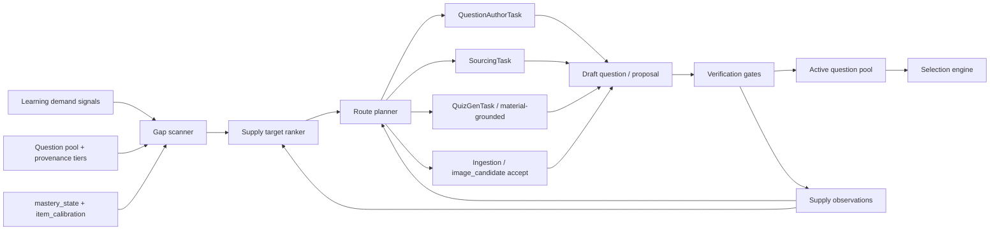

# Question Supply Target Discovery Architecture

**Date:** 2026-06-15
**Status:** Proposed architecture
**Related:** ADR-0042, ADR-0043, YUK-203, YUK-216, YUK-227, personalized calibration roadmap Phase 8

## Executive Summary

Question supply must be a separate engine from practice selection.

- **Selection engine:** decides what to practice from the active pool.
- **Supply target discovery engine:** decides what the pool is missing, why it matters, and which acquisition route should try to fill it.

The system already has execution routes:

- `QuestionAuthorTask` can author one draft question from knowledge/material and writes a `question_draft` proposal.
- `SourcingTask` can search existing web questions, insert `web_sourced` drafts, and chain `source_verify`.
- `image_candidate` can surface image-only sources and run VLM extraction only after user accept.
- `runSourcingSequence` already expresses a four-line consumer-side sourcing order: existing pool, external sourcing, material-grounded generation, closed-book fallback.
- `source_verify` is the promotion gate from draft to active pool.

The missing component is a deterministic-plus-statistical layer that produces acquisition targets before these routes run.

## Research Basis

The architecture uses four source-backed principles.

1. **Information is the right diagnostic currency.** Chang and Ying show that maximum item-information adaptive designs are consistent and asymptotically normal in the Rasch case. BanditCAT/AutoIRT similarly casts CAT selection reward as Fisher information and uses stochastic selection to balance precision and exposure.
   - Source: [Chang & Ying, 2009](https://arxiv.org/abs/0906.1859)
   - Source: [Sharpnack et al., 2024](https://arxiv.org/abs/2410.21033)

2. **A pool should be assembled against a target information/constraint profile, not just filled with more items.** Automated test assembly frames the bank as an optimization problem against a target information function and constraints.
   - Source: [Filipov & Gospodinov, 2015](https://arxiv.org/abs/1511.09216)

3. **Acquisition routes are exploration/exploitation arms.** Contextual bandits model dynamic content pools where only chosen actions reveal feedback; LinUCB-style confidence bonuses are a practical template once enough route-outcome data exists.
   - Source: [Li et al., 2010](https://arxiv.org/abs/1003.0146)

4. **Generated items need controlled features and psychometric validation.** AIG evidence shows generated item difficulty can be explained by task parameters and Rasch/LLTM-style modeling when the generation process has explicit features and validation.
   - Source: [Freund, Hofer & Holling, 2008](https://doi.org/10.1177/0146621607306972)

## Brownfield Map

### Existing execution routes

- `src/server/ai/question-author.ts`
  - Generates one draft question.
  - Inserts `question(draft_status='draft')`.
  - Writes `question_draft` proposal.
  - Accept promotes draft to active through `src/capabilities/practice/server/proposal-appliers.ts`.

- `src/server/boss/handlers/sourcing.ts`
  - Runs `SourcingTask` with Tavily + read-only domain tools.
  - Inserts `source='web_sourced'` drafts.
  - Emits `image_candidate` proposals for image-only sources.
  - Chains `source_verify`.

- `src/server/boss/handlers/source_verify.ts`
  - Runs tier-2 checks: structure completeness, source consistency, solve check, dedup.
  - Promotes draft to active and enrolls FSRS only on pass.

- `src/capabilities/ingestion/server/image-candidate-accept.ts`
  - Downloads image only after accept.
  - Runs one VLM extraction.
  - Inserts a tier-2 draft and chains `source_verify`.

- `src/server/quiz/sourcing-sequence.ts`
  - Existing pool first.
  - Then external sourcing.
  - Then material-grounded.
  - Then closed-book.
  - Already respects subject `sourcingRoutePreference`.

### Existing trust and calibration inputs

- `src/core/schema/provenance.ts`
  - Source tiers: authentic, sourced, material, generated.
  - Existing comparator: tier first, whitelist demotion second.

- `src/server/mastery/state.ts`
  - `mastery_state.theta_hat`, evidence counts, success/fail counts.

- `src/server/mastery/item-calibration.ts`
  - `item_calibration.b` as the difficulty anchor used by theta update.

- `src/db/schema.ts`
  - `question`, `knowledge`, `source_asset`, `source_document`, `event`, `material_fsrs_state`, `mastery_state`, `item_calibration`.

## Architecture



## Target Lattice

A supply target is not "write one question". It is a cell in a multidimensional pool:

```ts
type SupplyTargetKind =
  | 'coverage_gap'
  | 'frontier_gap'
  | 'diagnostic_gap'
  | 'source_quality_gap'
  | 'format_diversity_gap'
  | 'calibration_gap'
  | 'image_grounding_gap'
  | 'new_knowledge_scaffold';

type SupplyRoute =
  | 'author_question'
  | 'sourcing_web'
  | 'material_grounded'
  | 'closed_book'
  | 'ingest_existing'
  | 'image_candidate'
  | 'manual_review';

interface QuestionSupplyTarget {
  id: string;
  fingerprint: string;
  kind: SupplyTargetKind;
  subjectId: string;
  knowledgeIds: string[];
  requestedKind: string | null;
  difficultyBand: { minB: number; maxB: number } | null;
  desiredCount: number;
  minSourceTier: 1 | 2 | 3 | 4;
  routePreference: SupplyRoute[];
  priority: number;
  reason: string;
  constraints: {
    objectiveOnly?: boolean;
    needsImage?: boolean;
    allowGenerated?: boolean;
    requireSourceUrl?: boolean;
    requireMaterialBody?: boolean;
    maxCostMicroUsd?: number;
  };
  stopCondition: {
    activeQuestionCountAtLeast: number;
    sourceTierAtMost?: 1 | 2 | 3 | 4;
    kindMatch?: string;
    difficultyBand?: { minB: number; maxB: number };
  };
}
```

`fingerprint` should be deterministic over `(subjectId, knowledgeIds, requestedKind, difficultyBand, kind, minSourceTier)` so repeated scans update the same target instead of flooding jobs.

## Mathematical Model

### 1. Effective Pool Coverage

For a target cell `t`, define active matching questions:

```
Pool(t) = { q :
  q.draft_status != 'draft'
  and q.knowledge_ids intersects t.knowledgeIds
  and kind_match(q.kind, t.requestedKind)
  and b(q) in t.difficultyBand if present
}
```

Effective coverage is weighted, not raw count:

```
A(t) = Σ[q in Pool(t)] w_tier(q) * w_whitelist(q) * w_difficulty(q, t) * w_freshness(q)
G_coverage(t) = max(0, D(t) - A(t)) / max(D(t), 1)
```

Suggested initial weights:

```
w_tier: tier1=1.00, tier2=0.80, tier3=0.50, tier4=0.30
w_whitelist: off-whitelist tier2 = 0.75, otherwise 1.00
w_difficulty: exp(-((b_q - b_target)^2) / (2 * sigma_b^2)), sigma_b=0.75
w_freshness: 1.0 initially; later down-weight repeatedly used near-duplicates
```

This matches the existing provenance model: off-whitelist sources are demoted, not rejected.

### 2. Diagnostic Information Gap

For a knowledge node `k`, current ability estimate is `theta_k` from `mastery_state`.

Under the Rasch simplification already used by the project:

```
p(q, k) = sigma(theta_k - b_q)
I(q, k) = p(q, k) * (1 - p(q, k))
```

For a target band:

```
I_available(k, band) = Σ[q in Pool(k, band)] I(q, k)
I_target(k, band) = τ(k) * D_info(k, band)
G_info(k, band) = max(0, I_target - I_available) / max(I_target, ε)
```

`τ(k)` should be higher when:

- `evidence_count` is low but the node is due/frontier.
- `theta_se` is high once Urnings-lite uncertainty lands.
- ADR-0042 needs non-due MFI candidates near `theta_k`.

This is the supply-side mirror of MFI. Selection asks "which available item maximizes information now?" Supply asks "which missing item band would add the most future information?"

### 3. Source Quality Gap

A cell can be numerically covered but still weak if every item is generated or low-trust.

```
A_high(t, minTier) = count(q in Pool(t) where tier(q) <= minTier)
G_source(t) = 1 if A_high(t, minTier) < requiredHighTierCount else 0
```

Initial rule:

- Frontier/new-check cells should have at least one tier 1 or tier 2 item when web/ingestion is plausible.
- Calibration cells should prefer objective, source-grounded items.
- Generated-only coverage is acceptable for exploratory practice but not for difficulty calibration.

### 4. Format Diversity Gap

For each knowledge node, maintain a small desired distribution over question kinds:

```
P_desired(kind | subject, knowledge_role)
P_pool(kind | k) = active weighted pool distribution
G_diversity(k) = JS(P_desired || P_pool)
```

MVP can avoid the full divergence calculation and use quotas:

- At least one recall/check item.
- At least one application/transfer item for non-leaf concepts.
- At least one objective item if the node is used for calibration.

### 5. New Knowledge / Novelty Handling

For a new or frontier knowledge node with little evidence, do not use pure MFI. `theta_k` is not stable.

Use a scaffold ladder:

```
desired bands:
  evidence_count = 0: b around subject median or prerequisite-adjusted easy/medium
  evidence_count 1-2: b around theta_k with wide tolerance
  evidence_count >=3: MFI-centered bands around theta_k
```

This is how the engine handles "新颖" and "新知识点": it creates scaffold targets first, then diagnostic targets after evidence exists.

### 6. Overall Target Priority

The scanner produces candidate targets and the ranker computes:

```
Priority(t) =
  Demand(t)
  * (
      α * G_coverage(t)
    + β * G_info(t)
    + γ * G_source(t)
    + δ * G_diversity(t)
    + η * G_calibration(t)
    )
  - λ_cost * ExpectedCost(t)
  - λ_risk * QualityRisk(t)
```

Suggested starting constants:

```
α=0.35
β=0.25
γ=0.15
δ=0.15
η=0.10
λ_cost=0.05
λ_risk=0.10
```

`Demand(t)` comes from deterministic product signals:

- due but no usable active item
- frontier/new-check node
- failed diagnostic gap
- active plan `needs[]`
- source-quality weakness
- calibration objective gap
- user/goal-pinned learning item

## Route Planner

### MVP: Deterministic Constraint Planner

Use existing route semantics first:

```ts
function planRoutes(target: QuestionSupplyTarget): SupplyRoute[] {
  if (target.constraints.needsImage) {
    return ['sourcing_web', 'image_candidate', 'ingest_existing'];
  }
  if (target.minSourceTier <= 2) {
    return ['sourcing_web', 'ingest_existing', 'author_question'];
  }
  if (target.constraints.objectiveOnly) {
    return ['sourcing_web', 'author_question', 'material_grounded'];
  }
  if (target.constraints.allowGenerated === false) {
    return ['sourcing_web', 'ingest_existing'];
  }
  return target.routePreference.length
    ? target.routePreference
    : ['sourcing_web', 'material_grounded', 'author_question', 'closed_book'];
}
```

Mapping to current code:

- `sourcing_web` -> enqueue `sourcing` with `{ trigger:'knowledge', ref_id, count, knowledge_id, kind }`.
- `material_grounded` -> enqueue `quiz_gen` with `generation_method:'material_grounded'`.
- `closed_book` -> enqueue `quiz_gen` with `generation_method:'closed_book'`.
- `author_question` -> call `runQuestionAuthor` with `seed_mode:'knowledge'` or `seed_mode:'material'`; draft remains proposal-only.
- `image_candidate` -> not directly dispatched as a standalone job; it is an output of `SourcingTask`, then accept-driven.
- `ingest_existing` -> future crawler/import route; until built, emit a target/proposal for user-visible acquisition.

### Later: Route Bandit

Once observations exist, route choice becomes a contextual bandit.

For each route `r` and target feature vector `x_t`:

```
score(r, t) =
  μ_r(x_t)
  + c * sqrt(x_t^T A_r^-1 x_t)
  - λ_cost * cost_r
  - λ_latency * latency_r
  - λ_risk * risk_r
```

Reward should be continuous:

```
reward =
  1.0 * verified_active_question_count
  + 0.4 * accepted_proposal_count
  + 0.2 * high_tier_source_found
  - normalized_cost
  - duplicate_penalty
  - failed_verify_penalty
```

Do not start with this in production. Start deterministic, log observations, then replay route decisions offline.

## Persistence

### Recommended MVP Table

Add a lifecycle table only for targets, not for every candidate calculation:

```ts
question_supply_target {
  id text primary key,
  fingerprint text unique not null,
  status text not null, -- open | dispatched | satisfied | stale | failed
  kind text not null,
  subject_id text not null,
  knowledge_ids jsonb not null,
  requested_kind text,
  difficulty_band jsonb,
  desired_count integer not null,
  min_source_tier integer not null,
  priority real not null,
  reason text not null,
  constraints jsonb not null,
  route_plan jsonb not null,
  created_at timestamptz not null,
  updated_at timestamptz not null,
  satisfied_at timestamptz
}
```

Observation rows can be event-only at first:

```ts
event.action = 'experimental:question_supply'
event.subject_kind = 'query'
event.payload = {
  target_id,
  route,
  job_id,
  proposal_id,
  question_ids,
  status,
  checks,
  cost_micro_usd,
  before_pool_snapshot,
  after_pool_snapshot
}
```

Create `question_supply_action` only when the bandit/replay layer needs lower-latency queries.

## Services

### `src/server/question-supply/target-discovery.ts`

Responsibilities:

- Load active pool coverage by `knowledge_id`, kind, difficulty band, source tier.
- Load `mastery_state` and `item_calibration` summaries.
- Convert demands into `QuestionSupplyTarget[]`.
- Deduplicate by fingerprint.
- Compute priority.

It must not:

- Call LLMs.
- Insert questions.
- Promote drafts.
- Decide today's practice order.

### `src/server/question-supply/route-planner.ts`

Responsibilities:

- Translate targets into route plans.
- Respect `sourceWhitelist` and `sourcingRoutePreference`.
- Skip routes that cannot satisfy constraints.
- Estimate cost/risk from previous observations.

It must not:

- Bypass `source_verify`.
- Run VLM extraction without user accept.
- Treat generated questions as calibration-grade evidence.

### `src/server/question-supply/dispatcher.ts`

Responsibilities:

- Enqueue or call existing acquisition routes.
- Write `experimental:question_supply` events.
- Update target status.
- Single-flight by `fingerprint` or target id.

Recommended queues:

- `question_supply_discover` nightly and on-demand.
- `question_supply_dispatch` for open targets.

## Scanner Rules

Initial deterministic rules:

1. **Frontier gap:** if a frontier/new-check knowledge node has fewer than `2` active questions, create a `frontier_gap` target.
2. **No high-trust source:** if a node has only tier-4 generated questions, create `source_quality_gap` with `minSourceTier=2`.
3. **Diagnostic/MFI gap:** if no active item falls within `|b - theta_k| <= 0.75`, create `diagnostic_gap`.
4. **Calibration gap:** if a node has no objective, source-grounded item near theta, create `calibration_gap`.
5. **Kind gap:** if all questions are recall-style, create an application/transfer target.
6. **Image gap:** if subject/profile expects diagram/figure tasks and text-only pool dominates, create `image_grounding_gap`.
7. **New knowledge scaffold:** if `evidence_count=0`, create easy/medium scaffold targets before MFI targets.

## Verification Invariants

Supply target discovery cannot weaken existing gates.

- `web_sourced` drafts must pass `source_verify`.
- `image_candidate` extraction runs only after accept.
- `question_draft` authored by AI remains inert until user accept.
- Drafts never enter the active pool or FSRS until promoted.
- `source_tier` remains derived from provenance, not from route labels alone.
- Calibration-grade targets require objective/grounded evidence; generated-only questions are practice-grade, not calibration-grade.

## Rollout

### Phase 0: Architecture Only

- Land this document.
- Keep roadmap Phase 8 linked to it.

### Phase 1: Pure Scanner

- Implement `target-discovery.ts` as a pure module.
- Use fixtures to prove target generation from synthetic pool states.
- No queues and no writes.

### Phase 2: Target Persistence

- Add `question_supply_target`.
- Nightly scan opens/updates/stales targets.
- DB tests prove fingerprint dedup and satisfaction updates.

### Phase 3: Dispatcher

- Route open targets to existing `sourcing` / `quiz_gen` / `QuestionAuthorTask` routes.
- Write `experimental:question_supply` events.
- Do not add new verification behavior.

### Phase 4: Observability and Offline Replay

- Track route success, verification pass rate, cost, latency, user accept rate, eventual practice usage.
- Replay deterministic route planner vs UCB/Thompson candidates.

### Phase 5: Route Bandit

- Enable bandit route choice only after replay shows lift.
- Persist route inclusion probabilities if route policy becomes stochastic.

## Open Decisions

1. Should `ingest_existing` be a real crawler/import worker now, or only a proposal that sends the user to ingestion review?
2. Should supply targets appear in `/inbox`, `/knowledge/[id]`, or only admin/observability first?
3. What are the subject-specific desired kind distributions for math, physics, and wenyan?
4. Should `QuestionAuthorTask` background authoring be allowed automatically, or only when Copilot/user initiates it?

## Decision Recommendation

Ship **scanner + target table + dispatcher to existing safe routes** first.

Do not build a new internet crawler or a new LLM authoring loop yet. The repo already has strong route primitives and verification gates; the high-leverage missing layer is the target function. Once we can explain "this exact knowledge/kind/difficulty/source-tier cell is missing", the existing execution routes become much more useful and less prompt-shaped.
