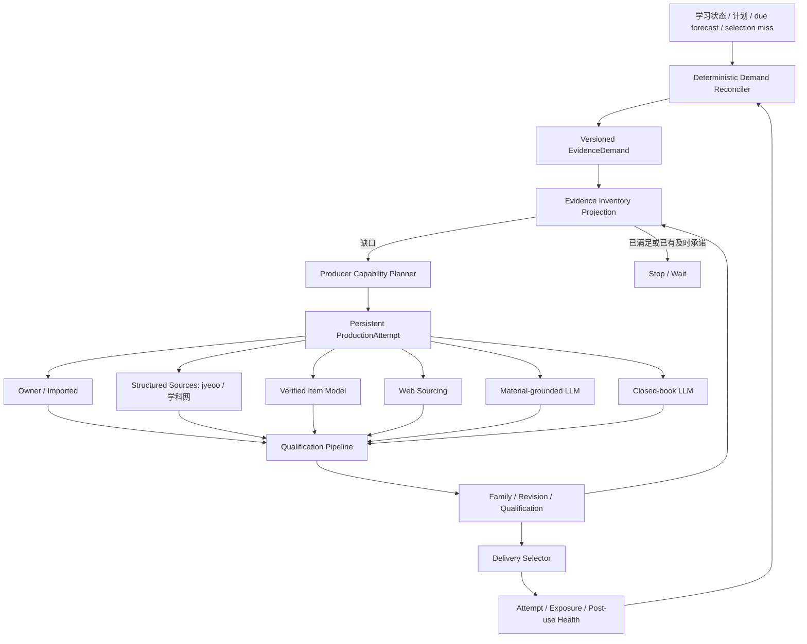

# Supply v2：证据需求驱动的可靠供给线

> 日期：2026-07-19  
> 状态：总体设计；Phase A 已拆 Linear，实施中  
> Linear 总账：YUK-698；jyeoo producer：YUK-697  
> 现行基线：`2026-06-15-question-supply-target-discovery-architecture.md`  
> 上游 rethink：`2026-07-10-question-supply-system-architecture-research.md`

## 1. Executive Summary

Loom 的题目供给线应从“扫描题目缺口后直接派发 sourcing/quiz_gen”升级为：

> **确定性控制面 + 概率决策层 + 可审计内容工厂 + 资格化证据库存 + Selection 反馈闭环**

“智能”不是给队列套更强的 LLM，而是系统能回答六个问题：

1. 未来缺什么学习证据；
2. 什么时候需要；
3. 哪个来源最适合补；
4. 产物具备什么使用资格；
5. 任一步失败后如何恢复；
6. 库存和在制承诺足够时何时停止生产。

系统边界：

- **确定性控制面**负责需求调和、幂等、预算、状态机、lease、outbox、恢复和停止条件；
- **概率决策层**估计未来需求、难度、题族候选和 producer 收益，但不直接提交不可逆状态；
- **内容工厂**包含 owner/import、结构化题源、item model、web sourcing 与 LLM producer；
- **资格系统**决定 revision 可用于 exploratory/formative/mastery/placement 中的哪些场景；
- **Selection**只消费满足当前用途的 revision，并把结构化 miss 反馈给 demand reconciler；
- **jyeoo-rs**是结构化 producer，不拥有独立控制面，也不等于供给线本身。



## 2. Current State and Gaps

### 2.1 已有可复用脊柱

| 能力 | 当前实现 |
|---|---|
| 确定性缺口扫描 | `src/server/question-supply/target-discovery.ts` |
| route plan / dispatch | `route-planner.ts`、`dispatcher.ts` |
| nightly refill + cooldown | `refill.ts`、`question_supply_nightly` |
| active + draft 检索 | `src/server/quiz/pool-fetch.ts`、`matcher.ts` |
| sourced/generated verify | `source_verify.ts`、`quiz_verify.ts` |
| verify + promote seam | `src/server/quiz/verify-and-promote.ts` |
| 难度后验 | `item_calibration`、`effectiveB` |
| provenance tier | `deriveSourceTier` |
| overlap signal | `maxNgramOverlap` |

### 2.2 当前模型缺口

当前 target 主要表达：

```text
KC × kind × difficulty band × source tier × count
```

它缺少：

- learner claim、observable evidence 和 allowed use；
- 独立题族数量而非 question 行数；
- needed-by、预算、最大尝试和 policy version；
- pipeline commitment 与库存的分离；
- producer capability、健康和实际 qualified yield；
- demand → target → job → question → verify → selection trace；
- 结构化 selection miss；
- verify enqueue 失败后的 durable recovery；
- versioned qualification 和 revision identity；
- 停止生产的可验证规则。

当前 `draft → active` 还把“验证通过”和“允许用于所有学习用途”合并在一起；
`item_family_calibration` 是统计参数，不是 QuestionFamily 身份；`extraction_hash` 是精确抽取
旁证，不是 structural family identity。

## 3. Domain Model

### 3.1 EvidenceDemand

Phase A 先将 `EvidenceDemand` 实现为 versioned contract 和投影，不立即新建持久表。

```ts
interface EvidenceDemandV1 {
  id: string;
  version: 1;
  claim: {
    subjectId: string;
    knowledgeIds: string[];
    learnerInference: string;
    prerequisiteState?: string;
    misconceptionIds?: string[];
  };
  evidence: {
    observable: string;
    responseMode: string;
    scoringModel: string;
    requiredIndependence: number;
  };
  task: {
    kinds: string[];
    cognitiveProcesses: string[];
    materialConstraints: string[];
    accessibilityConstraints: string[];
  };
  difficulty: {
    scale: string;
    interval: [number, number];
    basis: 'source_label' | 'expert_anchor' | 'personal_observation';
    confidenceMin: number;
  };
  inventoryGoal: {
    distinctFamilies: number;
    allowedUse: 'exploratory' | 'formative' | 'mastery' | 'placement';
    neededBy: string;
    reserveCount: number;
  };
  control: {
    maxCostUsd: number;
    maxAttempts: number;
    expiresAt: string;
    policyVersion: string;
  };
  causes: EvidenceDemandCause[];
}
```

需求信号：

```ts
type EvidenceDemandCause =
  | { type: 'due_forecast'; horizonDays: number }
  | { type: 'frontier' }
  | { type: 'selection_miss'; reason: SelectionMissReason }
  | { type: 'misconception'; misconceptionId: string }
  | { type: 'inventory_demotion' }
  | { type: 'owner_blueprint'; blueprintId: string }
  | { type: 'learning_plan'; planId: string }
  | { type: 'exposure_pressure' };
```

**D1**：signal 只标脏，不直接 `boss.send()`；唯一创建/更新 target 的权威是 reconciler。

### 3.2 EvidenceTarget

`QuestionSupplyTarget` 保留为当前 scanner/dispatcher 的兼容投影。目标态增加：

```ts
interface EvidenceTarget {
  id: string;
  demandId: string;
  demandVersion: number;
  fingerprint: string;
  cell: EvidenceCell;
  requiredFamilySlots: number;
  neededBy: string;
  policyVersion: string;
  state: 'open' | 'waiting' | 'satisfied' | 'exhausted' | 'expired' | 'canceled';
}
```

**T1**：同一 `(demand_id, demand_version, fingerprint)` 只能有一个 open target。

### 3.3 Family、Revision、Qualification

```text
QuestionFamily
  └── QuestionRevision
        └── Qualification
              └── Exposure / Attempt / Post-use Health
```

`QuestionFamily` 回答“这些 revision 是否提供独立证据”。支持：

```text
variant_of
shares_stimulus
same_solution_path
near_duplicate
revision_of
enemy
supersedes
```

题族判定流程：

1. canonical content hash 精确命中；
2. structural signature；
3. n-gram overlap；
4. embedding 召回；
5. 可选语义仲裁；
6. 确定性规则或 owner review 提交关系。

**F1**：LLM/embedding 只能提出 family candidate，不能独立提交 family identity。

题干、答案、rubric、来源或结构发生影响证据解释的变化时创建新 revision，不覆盖旧证据。
首期采用兼容投影 `question_id → revision_id → family_id`，dual-read 稳定前不替换 question 写模型。

Qualification 是 versioned multi-axis decision：

- provenance / license；
- deterministic validity；
- answer/scoring stability；
- independent solve；
- source grounding；
- family novelty；
- difficulty evidence；
- accessibility；
- teaching quality；
- post-use health。

派生 allowed use：

```ts
type AllowedUse = 'exploratory' | 'formative' | 'mastery' | 'placement';
```

**Q1**：source tier 只提供先验，不直接等于 allowed use。

## 4. Evidence Inventory

```ts
interface EvidenceInventory {
  eligibleOnHandFamilies: number;
  readyFamilies: number;
  reserveFamilies: number;
  pipelineCommitments: number;
  exposureBlockedFamilies: number;
  quarantinedFamilies: number;
  expiredFamilies: number;
  deficit: number;
}
```

规则：

- 独立单位是 qualified family，不是 question row；
- 同族十道 variant 在 required independence=1 时只算一个；
- 不满足 allowed use 的 revision 不计入 eligible on-hand；
- exposure-blocked 不计入当前 learner 的 eligible on-hand；
- reserve 是否可计入由 needed-by 与 activation lead time 决定；
- pipeline commitment 抑制重复生产，但不计入 eligible on-hand；
- expired/canceled/failed attempt 不计为 commitment。

Phase A 尚无 family 表，shadow projection 必须标为 **question-count upper bound**。

停止条件：

```text
effective_coverage = eligible_on_hand + timely_usable_reserve
valid_commitment   = non-expired in-flight slots likely before needed_by
deficit            = required_families - effective_coverage

coverage >= goal                         → satisfied，取消未开始的多余 attempt
coverage < goal 且 commitment >= deficit → waiting，不重复生产
commitment 不足或赶不上 needed_by        → 创建/升级 target
预算/attempt 耗尽或 demand 过期           → exhausted/expired，停止生产
```

**I1**：pipeline commitment 永远不提前满足库存。

## 5. Producer Capability and Planning

```ts
interface ProducerCapability {
  route: string;
  subjects: string[];
  supportedKinds: string[];
  supportedEvidenceUses: AllowedUse[];
  difficulty: { scales: string[]; controllability: number };
  provenanceTier: number;
  expectedLatencyMs: number;
  expectedQualifiedYield: number;
  expectedCostUsd: number;
  expectedReviewMinutes: number;
  authHealth: 'healthy' | 'degraded' | 'blocked';
  supportsStableIdentity: boolean;
  supportsImages: boolean;
  supportsFamilyHints: boolean;
  maxConcurrency: number;
  retryPolicy: string;
}
```

Producer portfolio：

1. owner/imported stable core；
2. 学科网、jyeoo 等结构化来源；
3. verified item model / 参数化模板；
4. web sourcing；
5. material-grounded LLM；
6. closed-book LLM。

Planner v1 是确定性的：

```text
allowed use 可兑现
→ subject/kind/material/accessibility compatibility
→ difficulty scale/controllability
→ lead time <= needed_by
→ auth/health
→ max cost/max attempts/CONWIP
→ expected qualified family yield / (latency × cost × risk × review burden)
```

有足够 attempt 数据后，shadow 学习 qualified yield、p50/p95 latency、cost、review minutes、
verifier disagreement 和 per-subject/kind failure rate。

**P1**：route policy 只优化生产结果，不直接使用 learner outcome，避免混淆题质、selection 和
learner state。

## 6. jyeoo Producer Contract

jyeoo 是 producer registry 中的一条结构化获取能力：

- 首期 subjects=`math`，支持 choice/fill_blank/short_answer；
- 初期 allowed use 只承诺 exploratory/formative；
- difficulty scale=`jyeoo_dg_v1`，basis=`source_label`；
- detail ID/URL 会漂移，`supportsStableIdentity=false`；
- `extraction_hash` 只做相同抽取结果旁证；
- canonical content hash 与 family identity 走 Loom 通用机械；
- target anchor KC 是权威，`knowledge_hints` 只作审计；
- VIP/auth/template failure 整批失败；
- 图片必须进入 asset/source_asset + `question.figures`，否则过滤整题；
- fallback 由通用 attempt/planner 决定，handler 不建第二控制面。

jyeoo dg 保存为：

```json
{
  "value": 3,
  "scale": "jyeoo_dg_v1",
  "basis": "source_label",
  "confidence": 0.4
}
```

不得把 dg 伪装成校准后的 IRT b；后续用 attempt 数据拟合 source-specific calibration。

## 7. Supply and Selection Coupling

```text
Supply：保证未来窗口存在足够的合格难度分布和独立 evidence families
Selection：从合格分布中选择当前 learner/session 最适合的 revision
```

Selection 三层：

1. **Hard eligibility**：KC、allowed use、qualification、revision health、family exposure、
   material/accessibility、scoring availability；
2. **Learning utility**：due、θ̂/effective b、mastery uncertainty、misconception、
   pedagogical role、session objective；
3. **Diversity**：family、stimulus、solution path、context、response mode、recent exposure。

难度是 soft preference，不是全局 hard filter。稀疏池允许 fallback，但必须记录：

```ts
type SelectionMissReasonV1 =
  | 'NO_ALLOWED_USE_ITEM'
  | 'NO_NEAR_DIFFICULTY'
  | 'ONLY_EXPOSED_FAMILIES'
  | 'NO_REQUIRED_KIND'
  | 'NO_TRUSTED_SOURCE'
  | 'NO_ACCESSIBLE_ITEM'
  | 'NO_SCORABLE_ITEM'
  | 'NO_INDEPENDENT_FAMILY'
  | 'ONLY_QUARANTINED_ITEMS';
```

Phase A 中 miss 只观测，不改变 fallback。后续 reconciler 还需判断 exposure 是否即将解除、是否
已有及时 pipeline、fallback 是否足够、producer 能否赶上 needed-by、budget/attempt 是否耗尽。

## 8. Difficulty Evidence

数字 `question.difficulty` 保持兼容，但新增：

```ts
interface DifficultyEvidence {
  value: number;
  scale: string;
  basis: 'source_label' | 'expert_anchor' | 'personal_observation';
  confidence: number;
  observedAt?: string;
  sourceRoute?: string;
}
```

优先级：

```text
personal calibrated item evidence
> expert anchor
> source label
> legacy/default proxy
```

`item_calibration` 继续作为 selection/mastery 的权威后验；不修改全局
`difficultyToLogitB` 迎合单个 producer。

## 9. Reliable Production Control Plane

```ts
interface ProductionAttempt {
  id: string;
  targetId: string;
  targetVersion: number;
  route: string;
  requestedSlots: number;
  completedSlots: number;
  qualifiedSlots: number;
  state:
    | 'planned' | 'leased' | 'producing' | 'qualifying' | 'partial'
    | 'succeeded' | 'failed' | 'exhausted' | 'canceled';
  leaseOwner?: string;
  leaseExpiresAt?: string;
  costUsd: number;
  attemptNo: number;
  failureClass?: string;
}
```

可靠性机械：

- target single-flight 由 DB unique constraint 保证；
- attempt 使用 lease，worker crash 后可回收；
- partial slot success 保留，只重试未完成 slot；
- route-specific retry 区分 auth/schema/network/timeout；
- producer persist 与 outbox intent 同事务；
- queue send 由 outbox dispatcher 完成；
- verify enqueue 失败只补发 verify；
- per-route CONWIP 防慢源拖垮 worker；
- target 有 maxCost/maxAttempts/expiresAt；
- event dirty reconcile 提供低延迟；
- nightly full reconcile 提供最终自愈；
- orphan candidate/verify recovery 可重复执行。

**R1**：候选已持久化后，任何 queue/verify 故障都不得重新运行昂贵 producer。

## 10. Qualification Lifecycle

```text
DRAFT → QUARANTINED → READY → RESERVE → ACTIVE → RETIRED
```

- DRAFT：刚产出的 candidate；
- QUARANTINED：等待验证或部分资格不成立；
- READY：通过 qualification，但未承诺进入 delivery；
- RESERVE：合格储备；
- ACTIVE：当前 selector 可见；
- RETIRED：失效、过曝、来源异常或 post-use health 下降。

verify pass 只意味着有资格进入 READY，不代表自动拥有所有 allowed use。Phase B 先做 shadow
projection，dual-read 稳定后再改变 serving。

## 11. Trace and Metrics

每个 candidate 必须可追溯：

```text
demand_id/version
→ target_id/fingerprint
→ production_attempt_id/route
→ candidate/question/revision
→ verify/qualification policy version
→ inventory cell
→ selection decision/miss
→ learner attempt/post-use health
```

北极星：

> **按 allowed use 分层的 qualified independent family coverage**

配套指标：

- selection structural miss rate；
- unmet target age；
- time-to-qualified-supply；
- route qualified yield；
- cost per qualified family；
- owner review minutes；
- duplicate/family exposure concentration；
- pipeline commitment accuracy；
- orphan/partial/recovery count；
- verifier disagreement；
- qualification demotion rate；
- active 后申诉和异常作答率；
- demand satisfied 后 overproduction；
- fallback route rate。

“抓了多少题/生成了多少题”只作为 throughput，不作为成功定义。

## 12. Rollout Plan

### Phase A：诚实脊柱（当前 milestone）

不改变 serving 行为：

| Issue | 内容 | 依赖 |
|---|---|---|
| YUK-699 | EvidenceDemand v1 + supply trace | — |
| YUK-702 | versioned structured selection miss | — |
| YUK-700 | verify outbox + orphan recovery | YUK-699 |
| YUK-703 | difficulty scale/basis/confidence | YUK-699 |
| YUK-704 | canonical content hash + exact dedup | YUK-699 |
| YUK-701 | current-table inventory shadow projection | YUK-699、YUK-702 |

```text
Wave 1: YUK-699 || YUK-702
Wave 2: YUK-700 → YUK-703 → YUK-704
Wave 3: YUK-701
```

YUK-697 producer hardening 可与 Wave 1 并行；Loom ingest seam 在 A1/A2/A3/A6 稳定后合并。

### Phase B：Family and Qualification

1. `question_family`；
2. immutable revision identity；
3. structural signature + embedding recall；
4. versioned qualification；
5. derive-on-read allowed use；
6. exposure-aware family inventory；
7. READY/RESERVE/ACTIVE shadow projection。

### Phase C：Reliable Control Plane

1. persistent evidence target；
2. generalized production attempt；
3. lease + partial slot；
4. transactional outbox；
5. route-specific retry；
6. CONWIP；
7. dirty/nightly reconcile；
8. orphan candidate recovery。

### Phase D：Supply/Selection Coupling

1. hard eligibility；
2. difficulty soft preference；
3. misconception/pedagogical utility；
4. family/stimulus diversity；
5. fallback miss → dirty demand；
6. 7–14 day due forecast。

### Phase E：Adaptive Planner

1. route outcome projection；
2. qualified-yield/latency/cost estimators；
3. source-specific difficulty calibration；
4. offline replay；
5. shadow planner；
6. small-traffic policy learning。

进入 Phase E 的门槛：qualification policy 稳定、attempt outcome 完整、样本量足够、shadow
决策可重放。

## 13. Suggested Module Boundaries

```text
src/server/evidence-supply/
  demand-schema.ts
  demand-reconciler.ts
  inventory-projection.ts
  producer-capability.ts
  producer-planner.ts
  target-store.ts
  attempt-store.ts
  attempt-runner.ts
  recovery.ts
  metrics.ts

src/server/question-family/
  content-hash.ts
  structural-signature.ts
  family-recall.ts
  family-decision.ts
  revision.ts

src/server/qualification/
  policy.ts
  qualify.ts
  allowed-use.ts
  lifecycle-projection.ts

src/server/quiz/
  selection-eligibility.ts
  selection-utility.ts
  selection-diversity.ts
  selection-miss.ts
```

最终公共面归入 practice capability。迁移期间允许旧 `src/server` 作为采石场，但不做 big-bang
搬迁，capability 间不使用深层 import。

## 14. Non-goals and Safety Rails

- Phase A 不创建 QuestionFamily/Qualification 持久表；
- 无足够 outcome 前不引入 contextual bandit；
- route policy 不直接优化 learner outcome；
- 不立即替换 `question.draft_status`；
- 不让 LLM 独立提交 family identity；
- 不把 pipeline commitment 当成可用库存；
- 不在 recovery 中重跑 producer；
- 不为 jyeoo 建特制控制面；
- 不将 source label 伪装成 calibrated b；
- 不做 schema + serving + selection 的一次性翻转。

## 15. External Design Grounding

- ETS Evidence-Centered Design for Learning：从 learner claim 推导 observable evidence，再构造
  task model；
- ITC/ATP Technology-Based Assessment Guidelines：题库治理需同时考虑覆盖、深度、可用性、
  曝光与安全性；
- CAT item-selection research：内容约束、信息准则和曝光控制需分层权衡；
- NIST AI RMF：生产 AI 需要独立验证、方法留痕和持续监控。

这些框架提供设计约束，不替代 Loom 自身的 n=1 learner model、事件核与 proposal/verify 边界。
