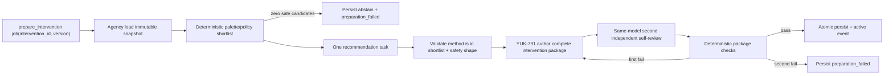

# YUK-796 — 教学法审议与干预准备：单脑、同波次、真实消费者

- **状态**：FINAL DESIGN（owner 已在联合 5/5 计划中选型）
- **日期**：2026-07-30
- **范围**：设计，不写生产实现
- **推荐形态**：Agency 内部的单次审议阶段，作为
  `prepare_intervention(intervention_id)` 同一波次的一部分
- **真实消费者**：YUK-791 的 intervention-scoped QuestionAuthor 与后续
  Teaching Brief 干预控制区
- **不做**：独立 Planning Panel、planner/critic/judge fan-out、新 agent 席位、
  通用 KC 题池回退、方法功效因果学习

## 1. 结论

审议能力要做，但它不是一个新“教研团”或新页面。它是 **Agency 持有的一个深模块**：

1. public interface 只接收 `intervention_id`；
2. Agency 从自己的真相源水合不可变 `InterventionSnapshot`；
3. 现有 pedagogy palette/policy 先做确定性候选过滤；
4. 一次 recommendation task 在合法候选中选择一个版本化方法，或明确
   `abstain`；
5. YUK-791 QuestionAuthor 在**同一个 prepare wave**消费该 recommendation，生成教学材料
   与即时/延迟/迁移诊断包；
6. 同模型第二次独立自审 + 确定性校验通过后，Agency 原子激活 intervention；
7. Teaching Brief 只投影证据、方法、材料、验证日程、失败原因和控制命令，不另建
   Planning Panel。

这里的 interface 很窄，implementation 很深：调用者不知道猜想、学习者状态、方法库、题目包和
审计如何拼装，也不能传 raw context 绕过权威快照。

## 2. 当前现实（code-grounded）

### 2.1 已有 palette 值得复用，但当前确实是 dead rail

- `method-library.ts` 明确记录零外部消费者、形态未定、由 YUK-796 决定复用/重构/废弃；
  设计前不接线也不删除
  （`src/core/pedagogy/method-library.ts:1-17`）。
- palette 是闭集 8 法，不是自由文本标签
  （`src/core/pedagogy/method-library.ts:21-30`）。
- 现有状态输入只有 `theta_band`、`precision_band`、`misconception_present`、
  `kc_is_rule_based`，并且 Zod `.strict()` fail closed
  （`src/core/pedagogy/method-library.ts:39-52`）。
- 方法定义已经包含适用 guard、禁忌 guard 和 evidence refs，library 会检查重复、缺项、
  惰性禁忌和永久不可选方法
  （`src/core/pedagogy/method-library.ts:106-170`）。
- `selectPedagogyCandidates` 只做确定性缩窄；被排除的方法不能被后续层恢复；零候选会报错
  （`src/core/pedagogy/policy.ts:26-58`）。
- 仓库对 `selectPedagogyCandidates`、`PEDAGOGY_METHOD_LIBRARY` 或
  `@/core/pedagogy` 的生产引用仍为零；ADR 也把它记录为零 caller
  （`docs/adr/0050-a13-dead-rail-ledger.md:125-135`）。

**判断**：复用 palette 和确定性 guard；不把它当完整 recommender。它解决“哪些方法不合法”，
不解决“本次干预为什么在合法方法中选这个”。

### 2.2 anti-swarm 是结构契约，不只是 prompt 文案

- 既有 director lane 的红线是单脑 director + 至多一个条件性 scout，而不是 fan-out panel
  （`docs/design/2026-07-06-yuk572-agent-meeting-lane-spec.md:7-13`）。
- director 是唯一可提议者；scout 显式工具面不能再 spawn，深度封顶为结构约束
  （`docs/design/2026-07-06-yuk572-agent-meeting-lane-spec.md:37-42`）。
- 运行时 prompt 再次固定“单一决策者 + 至多一名条件性侦察兵”
  （`src/ai/registry.ts:1853`）。
- scout 单测明确 pin 住无 `Task`、无 director 写工具、固定 tools allowlist 和
  `maxTurns=12`
  （`src/server/agency/scout/scout-agent.unit.test.ts:31-58`）。

**判断**：教学法推荐不能引入 planner/critic/judge 多 agent 座席。一次普通 recommendation
task 和一次独立 self-review 是**串行模型调用**，不是 agent swarm；二者都没有工具调用权和
proposal 权。

### 2.3 Teaching Brief 已是唯一合适的用户控制面

- Teaching Brief 的产品单位是 `/today` 上唯一的一份“为你而备”交付，四块内容为
  finding、basis、prepared_action、current_outcome；不展示多 agent 剧场
  （`docs/design/2026-07-19-teaching-brief-contract.md:12-38`）。
- 当前 live reader 已经持有 `brief_id`、状态、finding、basis 和判别式
  `prepared_action`
  （`src/capabilities/shell/server/teaching-brief.ts:91-132`）。
- 当前 confirmed 分支的 `practice_scoped` 只是跳到普通 KC practice；代码注释明确它不是
  YUK-505/506，也不自动改 daily stream
  （`src/capabilities/shell/server/teaching-brief.ts:145-170`）。
- 当前 brief union 只有 finding/probe/evidence/confirmed/retired，没有 intervention planning
  lifecycle
  （`src/capabilities/shell/server/teaching-brief.ts:173-205`）。

**判断**：未来把 intervention 控制区作为 Teaching Brief 的新 projection 分支或 section；
不要创建第二个“规划中心”。YUK-796 本身不写 UI。

### 2.4 当前 QuestionAuthor 不能承担 intervention authoring

- public intent 仍是 `.strict()` 的 `knowledge|material` seed，输入是 knowledge ids、题型、
  难度和素材，不接受 intervention
  （`src/ai/task-intents.ts:4-35`）。
- server seed 与它同形，且一调用只产一题
  （`src/server/ai/question-author.ts:1-22`、
  `src/server/ai/question-author.ts:62-90`）。
- preparation 只从 knowledge table 水合名称/领域/题型，不水合 conjecture、方法或
  intervention snapshot
  （`src/server/ai/question-author.ts:92-165`）。
- prompt 明确“一次只写恰好一道题”，输入仍是 knowledge/material
  （`src/ai/registry.ts:1028-1063`）。

**判断**：不能在旧 seed 上再塞几个 optional raw 字段。YUK-791 应新增 intervention authoring
入口；public input 只有 `intervention_id`，由 Agency public reader 提供权威 snapshot。

## 3. 方案比较

| 方案 | 结构 | anti-swarm | 真实消费者 | 结论 |
|---|---|---|---|---|
| **A. 同波次内部审议（推荐）** | `prepare_intervention` 内：确定性 shortlist → 一次 recommendation → package author → self-review → activate | 无新 agent；串行 task；写入仍由 Agency | 同 wave 的 YUK-791 QuestionAuthor；Teaching Brief projection | **采用** |
| B. 独立离线 recommendation job | 先持久化建议，未来另一 job 消费 | 可以不破 anti-swarm | 消费可能延迟或根本不发生 | 不采用：制造 split-wave、stale recommendation 和新的 dead rail |
| C. planner + critic + judge panel | 多席并行/互评后投票 | 直接扩大 agent 广度和写面 | 可以产出方案，但代价是新控制平面 | **拒绝**：违反 single-director anti-swarm，复活已否决的 fan-out |

### 为什么 A 不是“把所有东西塞进一个函数”

“同波次”是事务/编排边界，不是源文件边界。A 内部仍拆成三个深模块：

1. **Recommendation module**：输入 immutable snapshot，输出 versioned recommendation
   或 abstain；
2. **Package authoring module**：只消费 recommendation + snapshot，产出整包候选；
3. **Activation module**：只接受完整验证通过的 package，原子推进状态并发事实事件。

它们通过窄 typed interface 组合；不能彼此读对方表或接收 UI raw context。

## 4. 目标领域模型

### 4.1 `InterventionSnapshot`

Agency 在第一次 prepare 时冻结，后续同一 version 不重水合：

```ts
interface InterventionSnapshot {
  intervention_id: string;
  intervention_version: number;
  conjecture: {
    conjecture_id: string;
    claim_md: string;
    knowledge_id: string;
    cause_category: string;
    target_error_rule: string;
    diagnostic_spec: unknown;
    evidence_refs: Array<{ kind: string; id: string }>;
  };
  learner_context: {
    theta_band: 'novice' | 'developing' | 'secure';
    precision_band: 'low' | 'medium' | 'high';
    misconception_present: boolean;
    kc_is_rule_based: boolean;
  };
  prior_interventions: Array<{
    method_id: string;
    method_version: string;
    outcome: 'effective' | 'ineffective' | 'inconclusive';
  }>;
  disabled_method_ids: string[];
  created_at: string;
}
```

实现时应换成仓库现有 canonical schema 类型，而不是复制 `string`。上面只固定所有权和
必需信息。

### 4.2 `PedagogyRecommendation`

```ts
type PedagogyRecommendation =
  | {
      kind: 'recommendation';
      recommendation_version: 1;
      method_id: PedagogyMethodId;
      method_definition_version: string;
      rationale_md: string;
      safety_constraints: string[];
      candidate_ids: PedagogyMethodId[];
      excluded: Array<{ method_id: PedagogyMethodId; reason: string }>;
      model_run_id: string;
    }
  | {
      kind: 'abstain';
      recommendation_version: 1;
      reason_code:
        | 'no_safe_method'
        | 'insufficient_grounding'
        | 'conflicting_history'
        | 'model_output_invalid';
      detail_md?: string;
      candidate_ids: PedagogyMethodId[];
      model_run_id?: string;
    };
```

约束：

- model 只能从 deterministic shortlist 选择，不能恢复被禁用/contraindicated 的方法；
- shortlist 为空直接 `no_safe_method`，不调用模型；
- rationale 解释本次选择，不伪造方法因果排名；
- recommendation 必须在同 wave 被 package author 消费，否则本 wave 失败，不允许
  “先存一个以后再说”的成功态。

### 4.3 生命周期

```text
preparing
  ├─ recommendation abstain/invalid ───────────────> preparation_failed
  ├─ author or self-review fails after one retry ─> preparation_failed
  └─ complete package + checks pass ──────────────> active

active ── immediate fail ─> needs_revision
active ── cancel ─────────> canceled
active ── delayed/transfer settle ────────────────> settled

preparation_failed | needs_revision ── reprepare ─> new version / preparing
```

`reprepare` 必须新建 version，不能覆盖旧 snapshot、recommendation、package、run 或失败码。

## 5. 唯一公共命令与内部数据流

### 5.1 public command 与 worker interface

```ts
requestInterventionPreparation({
  intervention_id: string;
  idempotency_key: string;
}): Promise<{
  status: 'preparing';
  intervention_id: string;
  version: number;
}>;
```

command 在事务里冻结 snapshot、创建 `preparing` version，并以确定性 singleton key enqueue
`prepare_intervention`。长时模型调用不占住 HTTP request。worker job data 只含
`intervention_id`、`version`、`idempotency_key`；内部（非 public）深模块执行整个 wave：

```ts
prepareInterventionWave({
  intervention_id: string;
  version: number;
  idempotency_key: string;
}): Promise<
  | { status: 'active'; intervention_id: string; version: number }
  | {
      status: 'preparation_failed';
      intervention_id: string;
      version: number;
      reason_code: string;
    }
>;
```

取消和重新准备是另外两个 public 窄命令：

```ts
cancelIntervention({ intervention_id, idempotency_key, reason_md? });
reprepareIntervention({ intervention_id, idempotency_key });
```

禁止的 public input：

- `claim_md`、`cause_category`、KC、学习者状态；
- `method_id` 或模型 prompt；
- raw evidence、question prompt、reference；
- 局部 package。

这些都必须从 Agency SoT / snapshot 解析，防止调用方绕过 lineage 和安全策略。

### 5.2 同波次流程



实现要求：

- 整包最多重生成一次；
- 任何部分失败都不激活；
- worker 重试复用同一 idempotency key 和 effect ledger；
- terminal write 保存 snapshot version、recommendation version、全部 task run ids、失败码；
- event 只陈述事实；Practice 不推进 intervention 状态。

## 6. 模块边界与文件图（YUK-791 实现输入）

下面是**建议文件所有权**，不是 YUK-796 本票要创建的生产文件。

| 文件/模块 | 角色 |
|---|---|
| `src/capabilities/agency/public.ts` | 导出窄 command/read port；不导出表或内部 service |
| `src/capabilities/agency/server/intervention/contracts.ts` | snapshot、recommendation、status、outcome 的 canonical Zod |
| `src/capabilities/agency/server/intervention/prepare.ts` | 同波次 orchestrator；生命周期唯一写者 |
| `src/capabilities/agency/server/intervention/recommend.ts` | deterministic shortlist + recommendation task + abstain |
| `src/capabilities/agency/server/intervention/store.ts` | 事务、version、idempotency、事实事件 |
| `src/capabilities/agency/jobs/prepare_intervention.ts` | pg-boss adapter；manifest 注册 |
| `src/capabilities/practice/server/intervention-author.ts` | 只消费 Agency reader 返回的 snapshot；生成 1 份教学材料 + immediate/delayed/transfer 三题 |
| `src/capabilities/shell/server/teaching-brief.ts` | 只读投影 intervention control section |

### Capability 规则

- **Agency**：conjecture、recommendation、intervention、verification lifecycle 唯一写入者；
- **Practice**：生成和交付材料/题目，不决定 intervention status；
- **Shell**：只读 projection 和 typed command adapter，不拥有业务状态；
- 跨 capability 只通过 provider-owned `public.ts`；
- 不把 recommendation port 搬到 kernel，不建 service locator/DI container。

## 7. Teaching Brief 控制区

目标不是新页面，而是在 Brief 中显示：

- 猜想与 evidence trace；
- method id、方法版本、选择理由、安全约束；
- package/material version 和自审状态；
- immediate/delayed/transfer 的 FSRS 日程；
- 当前状态、失败码、lineage；
- `cancel`、`reprepare`、查看失败原因。

约束：

- 只读 projection；刷新不丢状态；
- `reprepare` 新版本，不覆盖历史；
- 自动激活，不增加逐次 owner approval；
- canceled/failed/expired 不能进入 Today/B3 obligations；
- 当前普通 `practice_scoped` 不能冒充 intervention-scoped session。

## 8. 闸门与依赖的最新解释

Tracker 快照（2026-07-30）：

- YUK-786 已 Done；
- YUK-821 已由 PR #1114 合并，固定 mock-input/real-output 回归从 6/8 改善到 7/8；
- YUK-827 保留 1 个 expected-target response 不可唯一判定的 P0 tail；
- YUK-814 严格三红线 Gate A、real-observation Gate B、canary Gate C 尚未全部通过。

因此：

1. **允许继续设计和实现**：owner 已裁定“相对固定旧基线有净改善即可过开发 gate”；
2. **不允许扩大无人值守自动干预**：Gate B/C 仍阻塞 expansion；
3. YUK-827 不抢占本设计 lane，但在启用自动 intervention 之前必须归零该 mismatch；
4. feature flag 默认 OFF；shadow/dev 可以产出可审计记录，不能自动进入 owner-wide 调度。

这取代旧文档里“必须等真实 owner 数据才能开始实现”的解释；真实数据仍是发布/扩量门，不是
继续开发的前置条件。

## 9. YUK-791 实施顺序

1. **契约与 migration**：Agency canonical schemas、versioned persistence、snapshot 冻结、
   idempotency；
2. **recommendation module**：接现有 palette/policy，加 disabled methods、history 和
   safety filtering；实现 recommendation/abstain；
3. **prepare orchestrator**：同 wave 持久化 recommendation 并立刻调用真实 consumer；
4. **QuestionAuthor intervention entry**：public input 只收 `intervention_id`；完整 package；
5. **self-review + deterministic checks**：一次整包 retry，之后 fail closed；
6. **activation/events**：原子 active、可重放、worker crash recovery；
7. **Teaching Brief projection/commands**：另按 UI pre-flight 批准后实施；
8. **Today/B3/verification**：消费 durable obligations，不把业务状态塞进排序器。

## 10. 验收与 stop conditions

### 设计完成

- [x] 至少 2 个方案并标推荐；
- [x] 解释与 anti-swarm 的结构兼容；
- [x] 明确 palette 复用方式；
- [x] 明确真实消费者；
- [x] 明确 public interface、所有权、状态、失败关闭和文件图；
- [x] owner 选型已记录：同波次、自动激活、同模型第二次独立自审、无独立 Planning Panel。

### 实现完成（YUK-791 及后继票）

- recommendation 每次都被同 wave 的 QuestionAuthor 消费；
- 无安全方法时 abstain；无普通 KC 题回退；
- 所有产物追溯到 intervention/method/conjecture/model run；
- package 只允许全有或全无激活；
- 重放、重复投递和 crash recovery 不重复副作用；
- Teaching Brief 可取消/重备并展示失败；
- targeted unit/DB/migration/E2E 通过；
- 完整 CI 只以 GitHub Actions `CI Gate` 为准。

### 立即停止

- 需要新增 agent 座席或 fan-out 才能工作；
- recommendation 可以成功落库但没有同波次 consumer；
- public API 需要 raw claim/evidence/method 才能调用；
- 任何失败会静默降级为普通 KC practice；
- implementation 试图让 Practice 或 Shell 写 intervention lifecycle；
- auto-intervention expansion flag 在 Gate B/C 前开启。
