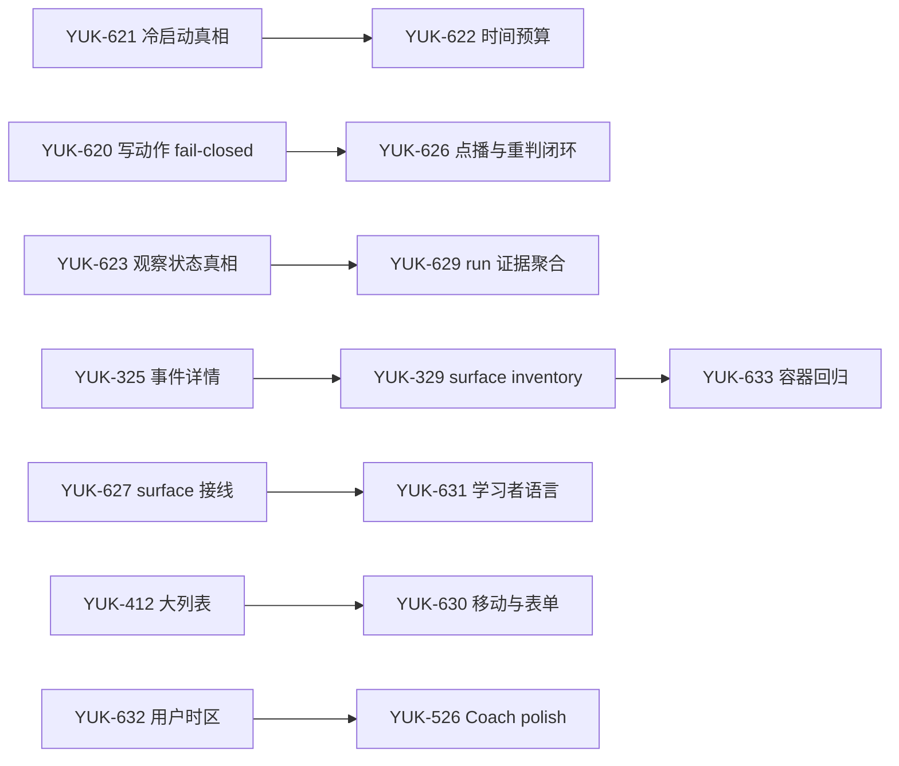

# 产品可用性硬化计划：Truth → Journey → Polish

> 状态：**EXECUTING**
> 启动：2026-07-13
> Linear 项目：[产品可用性硬化 — Truth → Journey → Polish](https://linear.app/yukoval-studios/project/产品可用性硬化-truth-journey-polish-9b0725fe1671)
> 总控 issue：[YUK-619](https://linear.app/yukoval-studios/issue/YUK-619/uh0-产品可用性硬化总计划与验收矩阵)
> ship 基线：`28dcd67f`（`tlp-deploy` / Docker 实际包含的 Vite SPA）

## 1. 决策与目标

暂停增加功能，把现有产品从「很多能力已经存在」打磨到「用户能相信、能走通、失败后能恢复」。
这一轮不以新增页面数、API 数或 AI 能力数衡量，而以五个结果衡量：

1. **Truth**：页面只陈述能够由当前数据证明的事实，不再把未扫描、无 active goal、请求失败写成健康或空库。
2. **Recoverability**：每个用户动作要么成功，要么显示原因和重试入口；禁止静默吞错和假成功。
3. **Journey**：已有能力从导航、搜索、详情、返回路径形成闭环，不再出现看得见但进不去的入口。
4. **Comprehension**：学习者界面使用学习语言，隐藏内部任务名、原始 ID、表名和工程状态。
5. **Operability**：同一组回归既在源码开发态通过，也在真实 Docker 运行形状通过。

## 2. 边界

### 本轮包含

- `/today`、`/practice`、Copilot、Knowledge、Note、Record、Coach 和 admin 观察面的可用性问题。
- API 错误语义、前端反馈、导航登记、可访问性、响应式、用户时区和容器验收。
- 为防止同类回归所需的最小读模型、测试夹具和自动化门禁。

### 本轮不包含

- 新的学习领域能力、新 AI agent、新推荐算法或新的自治循环。
- 借 bug fix 顺手重构 capability 边界、替换框架或重做视觉系统。
- 在问题未被真实用户路径消费前扩展 schema。
- 直接改动脏主工作区或当前运行的 `tlp-deploy`；实现和验证先在隔离 worktree 完成。

## 3. 现状证据与问题清单

2026-07-13 对 Docker 实际 ship 前端和 API 做了运行态核验，关键矛盾如下：

| 证据 | 用户风险 | 归属 |
|---|---|---|
| `/today` 仅以 `active goal count === 0` 判冷启动；同一库已有知识、题目和 9 个到期项 | 向老用户宣称「没有题库、没有复习」 | [YUK-621](https://linear.app/yukoval-studios/issue/YUK-621/uhu0-1-用证据状态替代-goal-only-冷启动判定) |
| practice stream mutation 在失败时继续本地乐观更新 | 排程看似成功，刷新后回滚，用户失去信任 | [YUK-620](https://linear.app/yukoval-studios/issue/YUK-620/uhu0-2-让-practice-stream-mutation-fail-closed-且可重试) |
| API 401 只清 localStorage，React 状态仍停留在已登录界面 | 用户卡在连续失败页，不能重新输入 token | [YUK-624](https://linear.app/yukoval-studios/issue/YUK-624/uhu0-3-让-401-立即回到可用-tokengate) |
| daily stream 的真实量级约 228 分钟，未服从用户时间预算 | 「今日计划」不可完成 | [YUK-622](https://linear.app/yukoval-studios/issue/YUK-622/uhu0-4-让-daily-practice-stream-遵守用户时间预算) |
| admin 观察面把未扫描或无运行记录呈现成健康 | 运维无法区分没检查与真正常 | [YUK-623](https://linear.app/yukoval-studios/issue/YUK-623/uhu0-5-区分未扫描与健康并显示-ai-run-失败原因) |
| 最近抽样 AI runs 全失败，错误聚集为 runner exit code 1 | 核心 AI 能力表面存在、实际不可用 | [YUK-625](https://linear.app/yukoval-studios/issue/YUK-625/uhu0-6-诊断并恢复容器-ai-task-runner-全失败事故) |
| Copilot 仍有 legacy blind auto-open 回归 | 未经用户意图打断当前任务 | [YUK-577](https://linear.app/yukoval-studios/issue/YUK-577/uhu0-7-移除-copilot-legacy-blind-auto-open-回归) |
| 点播与重判存在 placeholder / 假成功动作 | 用户无法判断动作是否真实发生 | [YUK-626](https://linear.app/yukoval-studios/issue/YUK-626/uhu1-1-清除-practice-点播与重判假成功动作) |
| Knowledge / Note / Record 有已实现 surface 未接通，也有假入口 | 导航与功能真相不一致 | [YUK-627](https://linear.app/yukoval-studios/issue/YUK-627/uhu1-2-接通已有-surface-并移除-knowledgenoterecord-假入口) |
| 证据链接落到未登记的 `/events/$id` | 追溯链 404 | [YUK-325](https://linear.app/yukoval-studios/issue/YUK-325/uhu1-3-登记-eventsid-详情并修复证据链接-404) |
| router、nav、manifest、搜索各自维护 surface | 页面持续出现可达性漂移 | [YUK-329](https://linear.app/yukoval-studios/issue/YUK-329/uhu2-1-建立-routernavmanifestsearch-单一-surface-inventory) |
| 题库大列表缺少分页/虚拟化，截断语义不诚实 | 数据增长后卡顿且数量误导 | [YUK-412](https://linear.app/yukoval-studios/issue/YUK-412/uhu2-2-给题库加分页虚拟化与真实-truncation-契约) |
| 动态 SubjectProfile 覆盖不完整，未知学科回落成通用 | 学科标签和行为错误 | [YUK-628](https://linear.app/yukoval-studios/issue/YUK-628/uhu2-3-补齐动态-subjectprofile-覆盖并停止错误归类通用) |
| AI 观察面重复信号且证据不可读 | 不能定位一次运行到底发生了什么 | [YUK-629](https://linear.app/yukoval-studios/issue/YUK-629/uhu2-4-聚合-ai-观察重复信号并提供人类可读证据) |
| 移动 drawer、表单 label、焦点和键盘语义不完整 | 小屏和辅助技术用户无法稳定操作 | [YUK-630](https://linear.app/yukoval-studios/issue/YUK-630/uhu3-1-修复移动-drawer-与核心表单交互语义) |
| 学习者 surface 暴露 task kind、表名、原始 ID | 产品语言像调试面板 | [YUK-631](https://linear.app/yukoval-studios/issue/YUK-631/uhu3-2-清除学习者-surface-的工程术语与原始-id) |
| Coach 日趋势按服务端日界而非用户时区 | 跨午夜数据落错日 | [YUK-632](https://linear.app/yukoval-studios/issue/YUK-632/uhu3-3-按用户时区切分-coach-日趋势) |
| Coach 三视图缺响应式和 a11y 收口 | 诊断价值在移动端不可稳定消费 | [YUK-526](https://linear.app/yukoval-studios/issue/YUK-526/uhu3-4-补全-coach-三视图-a11y-与响应式语义) |
| 没有容器级关键旅程回归 | 源码测试绿不代表 ship 产品可用 | [YUK-633](https://linear.app/yukoval-studios/issue/YUK-633/uhu3-5-建立容器级可用性回归门禁) |

既有相关单据 YUK-534、YUK-535、YUK-590 保留原项目所有权，已与本计划建立关联，避免重复造单。

## 4. 分阶段执行

### U0 — Truth & Recovery（目标 2026-07-20）

目标：先清除谎言、静默失败和运行事故，恢复最基本的信任。

1. **YUK-621 冷启动真相**：服务端输出显式证据状态；UI 不再自行用 goal 推断；补零证据、单一证据、无 goal 有数据三类回归。
2. **YUK-620 mutation fail-closed**：所有 stream 写动作以服务端成功为提交点；失败保留旧状态，显示原因和原位重试。
3. **YUK-624 401 re-gate**：认证失效同步清除 query/cache/session 状态，立刻回 TokenGate，保留用户可恢复路径。
4. **YUK-622 时间预算**：composer 和 UI 共用分钟预算合同；超出部分进入 later，不再把数小时任务叫今日计划。
5. **YUK-623 观察面状态机**：`unknown / scanning / healthy / degraded / failed` 明确分离；失败展示被清洗的原因与时间。
6. **YUK-625 runner 事故**：从容器 env、runner 启动、provider 调用、持久化链逐层定位；至少一个真实任务成功后才关闭。
7. **YUK-577 Copilot 意图门**：移除 blind auto-open，仅允许用户动作或明示策略打开。

U0 退出条件：同一生产快照下 `/today`、`/practice`、Copilot 与 admin 不再互相矛盾；任一失败动作都有可见反馈；容器内至少一条 AI run 成功。

### U1 — Journey Wiring（目标 2026-07-27）

目标：把已有能力接成完整旅程，删除不可兑现的按钮。

1. **YUK-626**：点播、重判从请求到持久结果闭环；未接通动作禁用并说明，不显示成功 toast。
2. **YUK-627**：逐项核对 Knowledge / Note / Record 的入口、详情、返回和空态；已有 surface 接通，假入口移除。
3. **YUK-325**：登记事件详情路由，所有 evidence link 可到达、可返回来源页。

U1 退出条件：核心 CTA 点击后都能到达真实结果；无 404 evidence link；无 placeholder success。

### U2 — Scale & Consistency（目标 2026-08-03）

目标：消除多份 surface 真相和数据增长后的可用性悬崖。

1. **YUK-329**：建立 surface inventory 单一权威，router/nav/manifest/search 从同一登记派生或受自动审计约束。
2. **YUK-412**：题库使用服务端分页或可证明的虚拟化；总数、已加载数、截断状态分别表达。
3. **YUK-628**：SubjectProfile 全 surface 使用同一动态 registry；未知学科显示真实未知态，不冒充通用。
4. **YUK-629**：按 run 聚合观察信号；错误、重试、子任务和证据按一次运行阅读。

U2 退出条件：新增/删除 surface 不需四处手工同步；大数据夹具下交互稳定；跨页学科身份一致。

### U3 — Polish & Regression（目标 2026-08-10）

目标：让产品在小屏、键盘、屏幕阅读器和真实容器里都能持续使用。

1. **YUK-630**：移动 drawer focus trap / escape / restore；核心表单补 label、错误关联和 loading/disabled 语义。
2. **YUK-631**：建立学习者文案映射，清除内部 task kind、表名、枚举和裸 ID。
3. **YUK-632**：Coach 日趋势以用户时区切日，并覆盖 DST / 跨午夜测试。
4. **YUK-526**：Coach 三视图补语义结构、键盘操作、对比度和窄屏布局。
5. **YUK-633**：把关键旅程做成 Docker smoke / browser regression，作为 ship 前门禁。

U3 退出条件：关键旅程在桌面和移动 viewport、键盘路径、Docker 构建产物上均通过；无学习者可见工程术语。

## 5. 依赖与实施顺序

当前第一刀是 YUK-621。随后按「运行事故与假成功优先」推进：YUK-625 → YUK-620 → YUK-624 → YUK-623 → YUK-622 → YUK-577。U1–U3 只在其依赖的 U0 真相合同稳定后进入实现。

## 6. 验收矩阵

| 层级 | 每个 issue 最低证据 | 阶段收口证据 |
|---|---|---|
| 纯逻辑 | 单元测试覆盖成功、失败、空、边界和重试 | `pnpm test:unit` |
| DB / API | 真实 testcontainer 夹具覆盖 wire 与持久结果 | 相关 `*.db.test.ts` + `pnpm test:db` |
| 类型 / 静态 | touched files Biome、TypeScript strict | `pnpm typecheck`、定向 Biome；收口跑完整 lint |
| Web 构建 | Vite 生产构建成功，无 dev-only import | `CODEX_FULL_GATE=1 pnpm build` |
| 运行形状 | 隔离 compose project 构建并启动 API + SPA + worker | health 200、关键 API 合同、worker 日志无启动错误 |
| 用户旅程 | 浏览器走登录、Today、Practice、证据详情、失败恢复 | 桌面 + 移动 viewport 截图/断言 |
| 数据诚实 | 同一 DB 快照跨页面数字和状态一致 | Today / Practice / Coach / admin 对账记录 |

YUK-621 专项验收矩阵：

| 场景 | 预期 |
|---|---|
| 所有学习证据为空 | 显示冷启动；文案只陈述已证明的空态 |
| 无 active goal，但有知识/题目/练习/会话/事件任一证据 | 显示正常工作台，不显示「没有题库/复习」 |
| summary 加载中或失败 | 显示 loading/error，可重试，不降级成冷启动 |
| 无 active goal 的正常工作台 | 只隐藏 goal-specific profile，其余 KPI、线程、记录可用 |

## 7. 发布、停止与回滚

- **隔离**：实现基于 Docker ship commit 建独立 worktree；不覆盖 dirty main，不直接编辑当前运行目录。
- **发布前**：先在独立端口/compose project 复现生产数据形状；通过后再决定合并和部署窗口。
- **数据安全**：本计划优先读模型和 UI 合同；涉及 mutation 的 issue 必须先写失败测试，禁止以清库或重建数据证明修复。
- **停止条件**：发现需要破坏性迁移、会中断正在运行的 job、或问题属于新产品能力时，停止该 issue 并回到 Linear 重新定界。
- **回滚**：每个 issue 保持可独立回滚；API wire 扩展采用 additive 字段，旧 consumer 在部署窗口内仍可读取原字段。
- **上线判断**：动态 gate 通过不等于验收；必须同时有代码测试、容器运行证据和真实用户路径复核。

## 8. 完成定义与 Linear closeout

每个 issue 只有在以下条件同时满足时才可 Done：

1. acceptance criteria 有对应自动测试或明确的人工证据；
2. 不再存在同路径 placeholder、吞错或冲突文案；
3. 定向 gate 通过，阶段收口时完整 gate 通过；
4. Docker 构建产物上的关键路径通过；
5. issue 评论记录变更、证据、残余风险和后续单据；
6. PR / commit 使用正确的 `YUK-NN` 关闭语义；未完成的 follow-up 已进 Linear，不留在代码 TODO 或聊天里。

总计划 YUK-619 只在 U0–U3 全部退出条件满足、YUK-633 容器门禁落地并完成最后一次 ship 复核后关闭。
